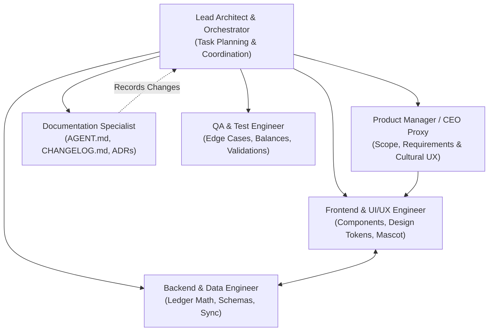

# AGENT.md — Tabby Agent Operating Manual

> **Application:** Tabby  
> **Tagline:** *"Keep tabs. Settle up."*  
> **Target Audience:** Friends, roommates, colleagues, and social circles in the Philippines  
> **Core Currency:** Philippine Peso (`₱` / PHP)  
> **Repository:** [https://github.com/Zalweb/Tabby](https://github.com/Zalweb/Tabby)  
> **Branch:** `main`

---

## 1. Executive Summary & Purpose

**Tabby** is a warm, socially frictionless personal and peer-to-peer financial tracking application built specifically for Filipino social spending habits. It eliminates the social anxiety, awkwardness, and friction surrounding shared expenses, dining out, borrowing ("utang"), and settling debts.

Traditional expense trackers feel cold, corporate, or confrontational. Tabby introduces a friendly cat mascot system, empathetic microcopy (Taglish and conversational English), and instant settlement shortcuts tailored for Philippine payment rails (GCash, Maya, Bank Transfer, and Cash).

---

## 2. Agent Departmental Roles & Responsibilities

All AI agents and human contributors operating within this repository act under distinct departmental roles to maintain separation of concerns, high technical velocity, and code quality.

### Role Matrix

| Department / Role | Primary Responsibilities | Deliverables & Scope |
| :--- | :--- | :--- |
| **Lead Architect / Orchestrator** | Task decomposition, technical direction, cross-agent workflows, code review. | Architecture roadmaps, PR reviews, workflow definitions. |
| **Product Manager / CEO Proxy** | Voice of CEO and user, cultural validation ("utang" etiquette), feature prioritization. | User stories, acceptance criteria, [`docs/PREFERENCES.md`](docs/PREFERENCES.md). |
| **Documentation Specialist** *(Current)* | Repository memory, technical guides, architectural decision records (ADRs), changelogs. | [`AGENT.md`](AGENT.md), [`docs/CHANGELOG.md`](docs/CHANGELOG.md), [`docs/DECISIONS.md`](docs/DECISIONS.md), API docs. |
| **Frontend / UI/UX Engineer** | Component architecture, Tailwind styling, brand tokens, mascot animation states. | UI components, page layouts, interactive split calculator. |
| **Backend / Data Engineer** | Ledger data models, double-entry balance math, offline SQLite/Supabase synchronization. | Schema migrations, balance calculation engines, API endpoints. |
| **QA & Reliability Engineer** | Financial rounding test cases, zero-balance verification, cross-device testing. | Unit test suites, end-to-end user journey tests, balance audit scripts. |

---

## 3. Brand System & Design Tokens Reference

All design and frontend implementations MUST strictly adhere to the brand guidelines established in [`assets/branding/BRANDING.md`](assets/branding/BRANDING.md).

### Core Palette
- **Charcoal Primary:** `#1F1F1F` — Headers, primary buttons, high-contrast structural elements.
- **Accent Highlight:** `#FFB74D` — Warm amber, mascot accents, pending badges, primary call-to-actions.
- **Background Light:** `#F8F8F8` — App viewport canvas, light mode surface.
- **Secondary Muted:** `#9CA3AF` — Subtitle text, inactive tabs, dividers, timestamp captions.
- **Surface White:** `#FFFFFF` — Cards, bottom sheets, modal dialogs.
- **Settled / Success Green:** `#10B981` — Fully settled tabs ("Bayad na"), positive balances.
- **Debt / Owed Red:** `#EF4444` — Amounts owed, critical alerts.

### Brand Assets
- **Main Icon:** [`assets/branding/tabby-icon.jpg`](assets/branding/tabby-icon.jpg)
- **Mascot Turnarounds & Emotion Sheet:** [`assets/branding/tabby-mascot-sheet.jpg`](assets/branding/tabby-mascot-sheet.jpg)

---

## 4. Operational Protocols & Rules of Engagement

To prevent configuration drift, broken context, and regressions, agents must obey these operational rules:

1. **Strict Context Preservation:**
   - Always inspect [`AGENT.md`](AGENT.md) and [`docs/PREFERENCES.md`](docs/PREFERENCES.md) before proposing UX, copy, or architecture changes.
   - Significant architectural decisions must be recorded as an ADR in [`docs/DECISIONS.md`](docs/DECISIONS.md).

2. **Single Source of Truth for Ledger Math:**
   - Financial balances must never rely on floating-point arithmetic. All amounts must be calculated and stored as integer centavos (or decimal with safe precision libraries).
   - `₱100.50` = `10050 centavos`.

3. **Cultural Tone & Microcopy Guardrails:**
   - Never use aggressive collection language (e.g., "Delinquent", "Overdue debt", "Penalty").
   - Prefer gentle, culturally attuned terminology: "Gentle nudge", "Paki-settle", "Bayad na ako", "KKB (Kanya-kanyang bayad)".
   - Refer to [`docs/PREFERENCES.md`](docs/PREFERENCES.md) for approved Taglish copy matrices.

4. **Git Discipline & Conventional Commits:**
   - Branch: `main`.
   - Commit formatting: `feat:`, `fix:`, `docs:`, `style:`, `refactor:`, `test:`, `chore:`.
   - Always confirm a clean working tree before marking tasks complete.

---

## 5. Planned Feature Roadmap

### Phase 1: MVP Core (1-on-1 Tabs & Settlements)
- [ ] **Quick Tab Entry:** Add an expense in under 5 seconds (Amount, Who paid, Who owes, Description).
- [ ] **1:1 Balance Tracker:** Clear running balance between two users (*"You owe Karl ₱250"* / *"Karl owes you ₱150"* -> Net: *"You owe Karl ₱100"*).
- [ ] **Payment Settlement ("Bayad Na!"):** Mark tab settled with payment method tagged (GCash, Maya, Cash).
- [ ] **Mascot Mood Integration:** Happy mascot on settlement; sleeping cat on zero balance.

### Phase 2: Group Tabs & Smart Split
- [ ] **Group Expenses (Barkada Trips, Dinners, Bills):** Multi-person bill splitting.
- [ ] **Split Modes:** Equal split, itemized split, and percentage/exact amounts.
- [ ] **KKB Mode (Kanya-Kanyang Bayad):** Quick tax + service charge distributor.
- [ ] **Gentle Reminder Links:** Shareable SMS/Messenger card with friendly mascot nudge graphic.

### Phase 3: Local-First Architecture & Cloud Sync
- [ ] **Offline-First Persistence:** SQLite / WatermelonDB / IndexedDB for instantaneous local access without internet.
- [ ] **Cloud Backup & Peer Sync:** Supabase / Postgres integration for multi-device sync and real-time tab updates.
- [ ] **Export & Audit:** Export tab history as CSV or shareable receipt snapshot.

### Phase 4: Financial Quality of Life & Polish
- [ ] **GCash / Maya Deep-link & QR Generator:** Display settlement QR codes directly inside the app.
- [ ] **Spending Analytics:** Monthly breakdowns of personal vs. shared expenditures.
- [ ] **Custom Mascot Costumes & Mood Packs:** Themed seasonal cat expressions.

---

## 6. Document Directory Index

- **Brand Guidelines:** [`assets/branding/BRANDING.md`](assets/branding/BRANDING.md)
- **Project Changelog:** [`docs/CHANGELOG.md`](docs/CHANGELOG.md)
- **User Preferences & Tone Guide:** [`docs/PREFERENCES.md`](docs/PREFERENCES.md)
- **Architecture Decision Records (ADRs):** [`docs/DECISIONS.md`](docs/DECISIONS.md)
