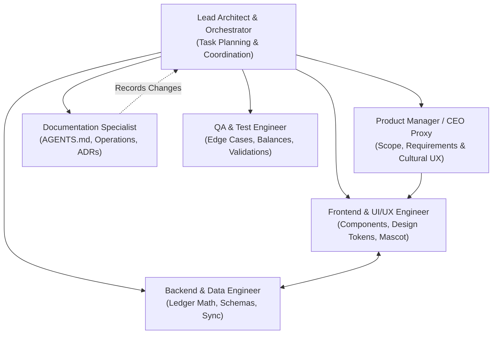
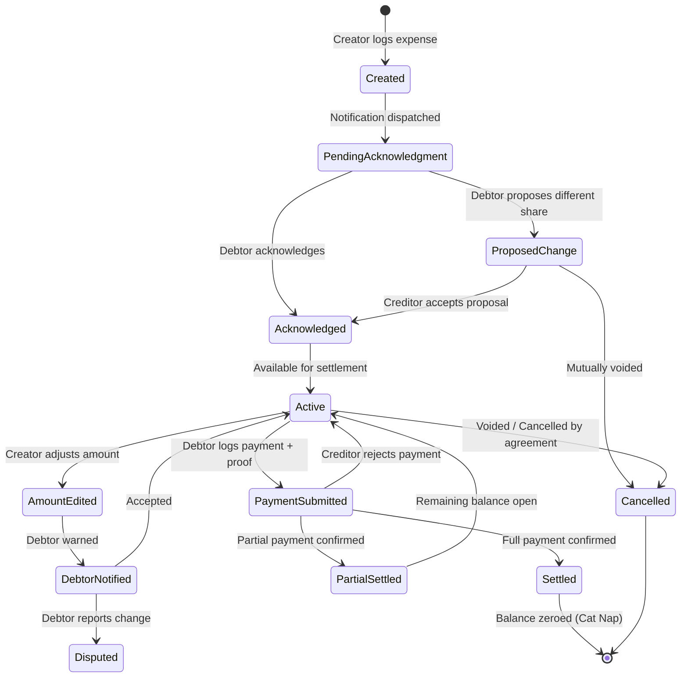
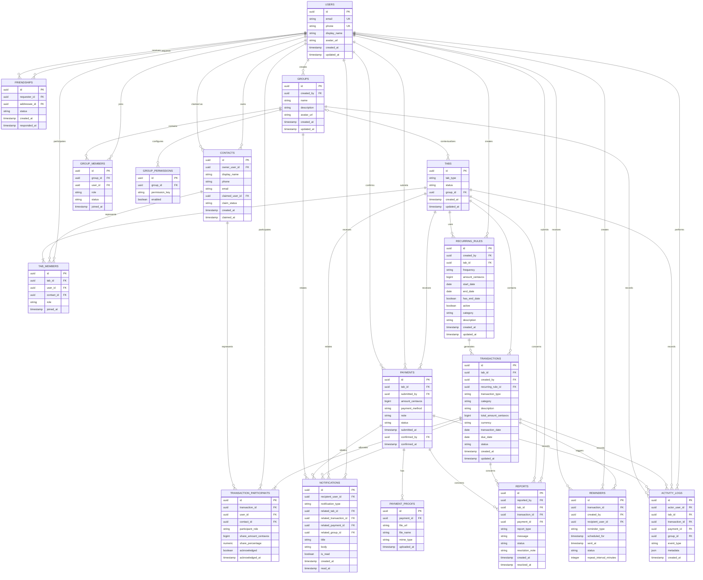
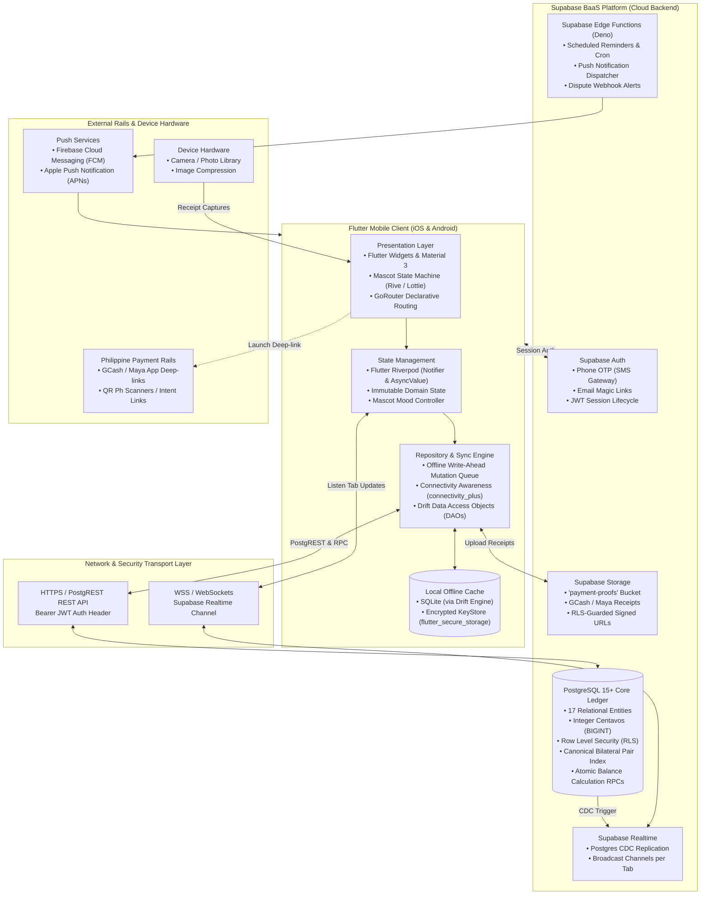
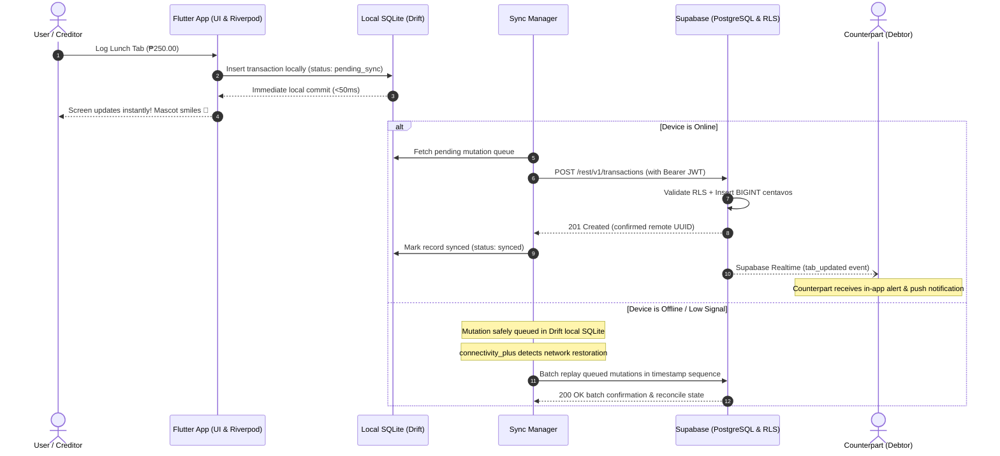
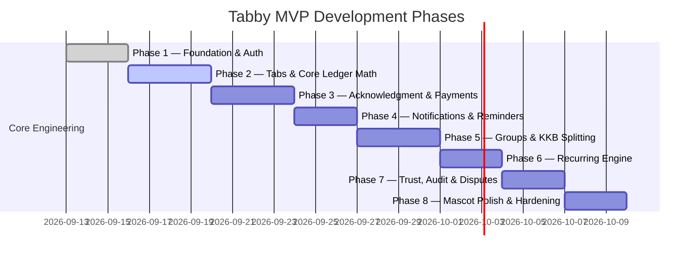

# AGENTS.md — Tabby Operating Manual & Project Source of Truth

> **Application:** Tabby  
> **Tagline:** *"Keep tabs. Settle up."* (Taglish alternative: *"Para klaro ang usapan."*)  
> **Target Audience:** Friends, classmates, roommates, barkadas, and couples in the Philippines  
> **Core Currency:** Philippine Peso (`₱` / PHP — Centavo-accurate integer arithmetic, `1 PHP = 100 centavos`)  
> **Repository:** [https://github.com/Zalweb/Tabby](https://github.com/Zalweb/Tabby)  
> **Branch:** `main`  
> **Documentation Model:** Single living document source of truth (`AGENTS.md`) per CEO directive.  
> **Scope:** Financial relationship tracking and social settlement coordination. Tabby does **not** process, hold, or transfer actual funds in the MVP.

---

## 1. Executive Summary & Philosophy

**Tabby** is a warm, socially frictionless peer-to-peer financial relationship and shared-expense tracker built specifically for Filipino social spending habits. It eliminates the social anxiety, awkwardness ("hiya"), and friction surrounding shared meals, dining out, borrowing ("utang"), and settling debts.

### Core Philosophy: *"Friendship First, Accounting Second"*
Traditional expense trackers feel cold, corporate, or confrontational. Tabby introduces a friendly cat mascot companion, empathetic Taglish/conversational English microcopy, and instant settlement shortcuts tailored for Philippine payment rails (GCash, Maya, Bank Transfer, and Cash).

### The Tab Principle: *"One Tab = One Financial Relationship"*
In Tabby, a **Tab** is the complete, running bilateral financial ledger between two parties. Regardless of whether two people have shared fifty dinners, grocery runs, or rides, there is only **one running Tab** between them. Tabby automatically computes the net balance from the current user's perspective, defusing interpersonal debt accounting into a single transparent number.

```text
Juan's Tab
-----------------------------
Dinner              +₱500.00
Juan paid           -₱200.00
Fare                +₱100.00
Borrowed cash       +₱300.00
-----------------------------
Net Balance         +₱700.00 (Juan owes you)
```

---

## 2. CEO Directives & Conversation Tracker

### Core Product Directives
1. **Never Weaponize Debts:** The app must never sound like a debt collector, a bank, or a legal demand letter. No red warning banners for standard pending tabs.
2. **Defuse Awkwardness with Warmth:** Asking friends for money is socially uncomfortable in the Philippines ("nakakahiya maningil"). Tabby absorbs that social tension through cute, disarming mascot animations, lighthearted reminders, and clear settlement links.
3. **Speed is King (<5 Seconds Entry):** Logging who paid for lunch must take under 5 seconds. If logging takes too long, users will fall back to disorganized Messenger group chats or forget entirely.
4. **Philippine-First Context:** The app is built from the ground up for the Philippine financial ecosystem (PHP `₱`, GCash, Maya, Cash, KKB dining habits).
5. **Consolidated Documentation (`AGENTS.md` Single Source of Truth):** Keep project documentation, operational protocols, branding tokens, ADRs, database specifications, user flows, and roadmap consolidated in `AGENTS.md`.
6. **Zero Floating-Point Drift:** All financial amounts must be stored and computed as integer centavos (`₱100.50` = `10050 centavos`).
7. **Append-Only Auditability:** Never silently overwrite financial history or destroy confirmed records. Always track revisions, cancellations, and disputes.
8. **Flutter + Supabase Native Foundation:** The client is built in Flutter for smooth, 60fps mascot animations, low-latency mobile UX, and local-first offline persistence (Drift/SQLite). The backend leverages Supabase (PostgreSQL 15+) for relational data integrity, Row Level Security (RLS), real-time synchronization, and secure receipt storage.

### CEO Conversation & Decisions Log

| Date | Stakeholder / Source | Directive / Decision | Rationale | Impacted Areas |
| :--- | :--- | :--- | :--- | :--- |
| **2026-09-13** | CEO / Product Lead | Adopt *"Keep tabs. Settle up."* as official tagline. | Simple, punchy, action-oriented, universally understood. | Branding, Splash screen, App Store metadata. |
| **2026-09-13** | CEO / Product Lead | Mascot must have turnaround views and explicit emotion states. | Humanizes transactions; visually signals zero-balance celebration ("Bayad na!"). | Mascot assets, UI empty states, animation hooks. |
| **2026-09-13** | CEO / Product Lead | Prioritize GCash & Maya as primary settlement references over credit cards. | GCash & Maya are the de facto P2P payment rails for Filipino peer groups. | Settlement flow, QR code viewer, receipt sharing. |
| **2026-09-13** | CEO / Product Lead | Enforce integer centavo calculations for all currency values. | Prevents IEEE-754 floating point rounding drift when splitting odd bills. | Ledger database, Calculation engine, API contracts. |
| **2026-09-13** | CEO / Product Lead | Consolidate documentation into `AGENTS.md` and remove secondary markdown files. | Keep agent and team context in a unified living document to streamline workflows. | `AGENTS.md`, `README.md`, repository structure. |
| **2026-09-13** | Product Plan / ERD | Incorporate full specifications from `PLAN.md` and `TABBY_ERD.md`. | Elevate `AGENTS.md` into the comprehensive master guide for data architecture, flows, and implementation. | `AGENTS.md` (Sections 6–12). |
| **2026-09-13** | CEO | Adopt Flutter for Mobile Client and Supabase for Backend/Database (*"Now i'm planning to create this using the supabase of the backend and in the mobile using flutter."*). | High-performance cross-platform iOS/Android support, rich mascot animations, local-first offline capabilities, relational PostgreSQL schema with RLS, integer BIGINT centavos, storage for GCash/Maya receipts, and real-time ledger synchronization. | Mobile Client (Flutter), Backend BaaS (Supabase), Local Caching (Drift/SQLite), State Management (Riverpod), Cloud Storage & Auth. |
| **2026-09-13** | CEO | Add Onboarding flow and Login / Sign-up authentication pages. | Introduce friendly mascot-led onboarding (3 value props) and clean auth gate before reaching dashboard. | Navigation Router, `AppState` session management, Onboarding (`/onboarding`), Login (`/login`), Sign Up (`/signup`). |
| **2026-09-13** | CEO | Adopt clean conversational English (no Tagalog) and zero emojis across all UI text and copy. | Keep UI modern, clean, globally readable, and professional while retaining companionable warmth without emoji clutter or dialect barriers. | Microcopy, Button Labels, Mascot FSM dialogue, Screen copy across all features. |
| **2026-09-14** | CEO | Complete all app features and eliminate dead buttons across all pages. | Implement full interactive stateful logic for Profile settings (avatar options, QR manager, security & notifications switches with Riverpod persistence, currency precision, sync diagnostics, help center, add friend, friend options, create group, group options, logout), Tab Detail (QR preview modal, receipt preview modal, receipt attachment, friendly reminder link copying, settlement modal, payment info sheet), Home Dashboard (filter segmented buttons, notification center sheet, activity details), and Add Expense (both friend and group choice chips, custom amounts, date picker, receipt toggle). | `ProfileScreen`, `TabDetailScreen`, `HomeDashboardScreen`, `MyTabsScreen`, `AddExpenseModal`, `NotificationCenterSheet`, `interactive_features_test.dart`. |
| **2026-09-14** | QA / Tech Lead | Execute comprehensive E2E frontend and backend verification testing suites. | Build and verify full automated test coverage for every screen, button interaction, modal lifecycle, and backend ledger calculation engine (ADR-001 integer centavos, Supabase serialization, zero drift over 10k ops). Resolved modal RenderFlex overflows, context shadowing, and SnackBar queuing across all sheets. 65/65 tests passing across all 10 test files with 0 analysis issues. | `backend_data_handling_test.dart`, `e2e_all_screens_buttons_test.dart`, `interactive_features_test.dart`, `tab_detail_screen.dart`, `add_expense_modal.dart`. |
| **2026-09-14** | CEO / DevOps | Build direct download production release packages for Android (.apk) and iOS (.ipa). | Generated and verified standalone `Tabby.apk` (Android release binary) and `Tabby.ipa` (iOS release archive built via GitHub Actions macOS runner, unzipped and delivered directly) in `releases/` directory and published to GitHub Releases for direct installation. | `releases/Tabby.apk`, `releases/Tabby.ipa`, `.github/workflows/build-ios.yml`, GitHub Releases. |
| **2026-09-14** | CEO / Security | Configure platform-specific Google OAuth clients and browser OAuth fallback. | Configured the iOS client `137141086000-qnr5kedgh9miig5mmaaq90efn90gckmm.apps.googleusercontent.com`, Android client `137141086000-f3r8kjlkotpu05o6l5s8l3nvklsfdac7.apps.googleusercontent.com`, and Web client `137141086000-p2o6c1hminjif8i5f739n3a6ils7ucmm.apps.googleusercontent.com`. Native Android resolves its client through package/SHA-1 registration and exchanges tokens using the Web client; iOS uses its native client and reversed URL scheme; Supabase uses the Web client. | `.env`, `supabase_tabby_repository.dart`, `ios/Runner/Info.plist`, `.github/workflows/`, `releases/`. |
| **2026-09-16** | Lead Architect / QA | Complete second-pass security, offline resilience, and UI overflow audit. | Hardened sensitive user columns (GCash/Maya/QR) via SQL RLS & sanitized search function, isolated payment proof storage policies, implemented FlutterSecureStorage offline local caching (`TabbyLocalCache`) with zero blank screen on launch, enabled group tab sync and receipt deserialization in `fetchTabs` / `parseTabRow`, resolved modal RenderFlex overflows in `TabDetailScreen`, eliminated context shadowing in `ProfileScreen` sync diagnostics, eliminated empty string crashes in avatar substrings across all screens, added Maya number support to add friend flow, and achieved 75/75 passing tests with 0 `flutter analyze` issues. | `AGENTS.md`, `tabby_local_cache.dart`, `supabase_tabby_repository.dart`, `tabby_providers.dart`, `models.dart`, `tab_detail_screen.dart`, `profile_screen.dart`, `home_dashboard_screen.dart`, `my_tabs_screen.dart`, `notification_center_sheet.dart`, `20260913000001_core_schema.sql`, `20260913000002_rls_policies.sql`, `20260913000004_storage_and_triggers.sql`, `schema_all.sql`, `backend_data_handling_test.dart`. |
| **2026-09-16** | Skeptical Auditor / QA | Fix logout async deadlock, member name resolution, form validations, group member UUID persistence, and overflow safety across all modal sheets. | Decoupled UI state reset from asynchronous storage/network purge during logout to eliminate pending timer deadlocks. Enhanced `parseTabRow` with support for `raw_user_meta_data`, `paid_by` fallback, and payment receipt URL deserialization. Bound `selectedFriendIds` to `memberUserIds` in group creation. Added phone/email validation and `isSubmitting` guards across all friend sheets. Added `isScrollControlled: true` and `SingleChildScrollView` to all modal sheets. Expanded test coverage to 77/77 tests passing with 0 `flutter analyze` issues. | `profile_screen.dart`, `tab_detail_screen.dart`, `add_expense_modal.dart`, `supabase_tabby_repository.dart`, `backend_data_handling_test.dart`, `interactive_features_test.dart`, `AGENTS.md`. |
| **2026-09-16** | Lead Auditor & Security | Full end-to-end audit: RLS transaction insertion, participant payer preservation, payment proofs, receipt attachment persistence, tab archiving, 404 error page, pull-to-refresh, and form validations. | Fixed RLS violation in `logExpense` by setting `created_by = currentUserId` while maintaining actual payer in `transaction_participants` (`participant_role = 'payer'`). Enhanced `parseTabRow` to attribute true payer from participants and deserialize payment proofs from nested relation. Connected `attachReceipt` and `archiveTab` in Supabase repository and Riverpod state. Added custom 404 / ErrorBuilder in `app_router.dart`. Hooked live data refresh into `HomeDashboardScreen` and `MyTabsScreen` pull-to-refresh. Added email/phone/password client validation to `SignUpScreen`. Synced `schema_all.sql` with RLS migration. Expanded test suite to 81/81 passing tests with 0 analysis issues. | `app_router.dart`, `supabase_tabby_repository.dart`, `tabby_providers.dart`, `home_dashboard_screen.dart`, `my_tabs_screen.dart`, `signup_screen.dart`, `add_expense_modal.dart`, `schema_all.sql`, `backend_data_handling_test.dart`, `e2e_all_screens_buttons_test.dart`, `AGENTS.md`. |
| **2026-09-17** | Lead DevOps & Backend | Live database migration deployment, MCP configuration, and release artifact generation. | Permanently configured Supabase PAT across `mcp_config.json` and Windows environment. Executed and verified database migrations directly against live Supabase cloud instance (`ziaqrkagsvozhotremsx`): payment settlement RLS policy (`submitted_by = auth.uid() OR confirmed_by = auth.uid()`), bilateral tab race condition guard, and payment proofs storage policy. Dispatched and verified GitHub Actions release workflows for Android APK (Run #35126212329) and iOS IPA (Run #35126264152), both completing successfully. | `AGENTS.md`, `mcp_config.json`, GitHub Actions, Supabase Production Database. |
| **2026-09-17** | Lead Security / QA | Require a real Supabase session for every authentication path and enforce session-bound data authorization. | Removed offline credential fallbacks and false password-reset success, made routing trust the live Supabase session, isolated local cache data per user, restricted tab/group/member/payment/participant writes with RLS, protected financial identity fields with append-only triggers, and locked security-definer RPCs to authenticated owners. Applied and verified migration `20260917000001_authz_hardening.sql` on the linked Supabase project; final suite reached 82 passing tests with clean Flutter analysis. | `login_screen.dart`, `signup_screen.dart`, `app_router.dart`, `tabby_local_cache.dart`, `tabby_providers.dart`, `supabase_tabby_repository.dart`, `20260917000001_authz_hardening.sql`, `schema_all.sql`, auth and E2E tests. |
| **2026-09-17** | Lead Architect / Tech Lead | Resolve tab and data loss on sync/pull-to-refresh; build and install release on connected Android tablet (`TB321FU` / `HA27LVV6`). | Diagnosed and eliminated root causes of data loss: (1) prevented `_loadTabs()` from overwriting in-memory tabs with empty list when cache was partially loaded, (2) implemented bi-directional merge of local pending entries and server tabs to prevent un-synced entries from being dropped, (3) deployed `get_or_create_contact_tab` RPC and updated `get_transaction_payer_id` in live Supabase instance (`ziaqrkagsvozhotremsx`), (4) persisted contact tabs to Supabase upon adding friends or expenses, (5) enforced user ID scoping on all `TabbyLocalCache` operations. Verified with 83/83 passing tests and zero analyzer issues. Built release APK with live Supabase config and deployed directly to user's connected tablet. | `tabby_providers.dart`, `supabase_tabby_repository.dart`, `profile_screen.dart`, `backend_data_handling_test.dart`, `AGENTS.md`. |
| **2026-09-17** | Lead Mobile Engineer & Security | Configure native Android Google Sign-In with serverClientId audience, fix package alignment, and verify release build on tablet. | Fixed `MainActivity.kt` namespace alignment to `com.zalweb.tabby`, updated `GoogleSignIn` to pass `clientId: null` on Android while retaining backend `serverClientId` (Web Client ID audience for Supabase token exchange), added `io.supabase.tabby://login-callback` deep link to `supabase/config.toml`, verified with 84/84 passing tests and zero analyzer issues, built release APK, and deployed directly to connected Lenovo tablet (`HA27LVV6`). | `lib/features/tabs/data/supabase_tabby_repository.dart`, `supabase/config.toml`, `test/android_package_alignment_test.dart`, `releases/Tabby.apk`, `AGENTS.md`. |
| **2026-09-17** | Lead Frontend & Web Architect | Build and deploy modern minimalist web home page to Vercel with automated GitHub release-aware APK download engine. | Designed and created a high-craft, minimalist responsive landing page (`docs/index.html`, `docs/styles.css`, `docs/app.js` mirrored to `landing/`) reflecting Tabby's brand system (Charcoal `#1F1F1F`, Warm Amber `#FFB74D`, Clean Canvas `#F8F8F8`, Surface White `#FFFFFF`). Implemented automated release synchronization engine that queries `api.github.com/repos/Zalweb/Tabby/releases/latest` to dynamically update download links, version tags, file sizes, publication dates, and changelogs on every new build release, with canonical permanent redirect fallback (`releases/latest/download/Tabby.apk`). Updated `build-android.yml` to publish both versioned and canonical `Tabby.apk`. Deployed live to Vercel production at `https://tabby-web-fawn.vercel.app` (linked to `Zalweb/Tabby` repository on team `zalwebs-projects`). Verified with 100% automated test suite. | `docs/index.html`, `docs/styles.css`, `docs/app.js`, `docs/assets/`, `landing/`, `.github/workflows/build-android.yml`, `test/web_landing_test.js`, Vercel (`https://tabby-web-fawn.vercel.app`), `AGENTS.md`. |
| **2026-09-17** | CEO / Web & Mobile Lead | Build and deploy release v1.0.1 across GitHub Releases and live Vercel web home page; configure 3-mockup phone showcase and remove public GitHub links. | Bumped version to `v1.0.1+2`, built production release APK (`releases/Tabby-v1.0.1.apk`, `releases/Tabby.apk`, 68.9 MB) both locally and via GitHub Actions run #35149051049, and published to GitHub Release `v1.0.1`. Configured responsive 3-phone mockup showcase displaying Homepage, Banner Page, and Tab Page across desktop and mobile. Removed all public GitHub repository links from web header and footer per directive. Verified dynamic release sync engine seamlessly bound live download URLs and version tags to `v1.0.1` on `https://tabby-web-fawn.vercel.app`. | `docs/index.html`, `docs/app.js`, `landing/`, `releases/Tabby-v1.0.1.apk`, `releases/Tabby.apk`, GitHub Release `v1.0.1`, Vercel (`https://tabby-web-fawn.vercel.app`), `AGENTS.md`. |
| **2026-09-17** | CEO / Frontend & Mobile Lead | Replace mockup reference graphics with real Pixel emulator app screenshots and deploy live to Vercel. | Ran Pixel 9 Pro XL emulator, authenticated demo user, created active shared ledger tabs with live Philippine Peso balances and mascot states, and captured crisp native screenshots for the 3 mockup phones: (1) Homepage (`preview-home.png`: Home dashboard with active balance `₱125.00`, You're Owed cards, mascot state, and quick actions), (2) Banner Page (`preview-banner.png`: Onboarding mascot welcome card and value proposition), and (3) Tab Page (`preview-tab.png`: Juan's Tab detail with `₱125.00` balance, Remind Juan, Confirm Payment, and Ledger History). Deployed live to Vercel production at `https://tabby-web-fawn.vercel.app` and verified 100% test pass. | `docs/assets/`, `landing/assets/`, `docs/index.html`, `test/web_landing_test.js`, Vercel (`https://tabby-web-fawn.vercel.app`), `AGENTS.md`. |
| **2026-09-17** | Lead DevOps & Web Lead | Publish new Android APK build from GitHub Actions run 35162436882 to GitHub Release and update web home page download button. | Retrieved latest release APK from GitHub Actions run 35162436882 (commit `c12e280` — Tabby ID expense connections, sha256 `35e594f6f8f248c65e99f7649c5a1965394119ab01c2f5c213301d34716bf948`), automated release asset attachment via workflow dispatch, updated local release binaries in `releases/Tabby.apk`, and verified that the web home page download buttons and dynamic release engine immediately serve and download the updated APK. | `.github/workflows/publish-release-apk.yml`, `releases/Tabby.apk`, GitHub Release `v1.0.1`, Vercel (`https://tabby-web-fawn.vercel.app`), `AGENTS.md`. |
| **2026-09-17** | CEO / Frontend & Web Lead | Restructure web homepage hero section to two-column desktop layout with left-aligned copy and right-side layered phone mockup stage. | Updated `docs/` and `landing/` with responsive 2-column grid (`1fr 1.08fr`, gap: 48px). Left column presents status badge, headline, subtitle, primary/secondary CTAs, and direct APK metadata. Right column presents layered 3D phone mockup showcase (Homepage, Banner Page, Tab Page) with floating balance (+₱700.00) and settlement rail badges, seamlessly collapsing to single column on mobile (<992px) with horizontal swipe. Verified with 100% automated web landing test suite. | `docs/index.html`, `docs/styles.css`, `landing/index.html`, `landing/styles.css`, `test/web_landing_test.js`, `AGENTS.md`. |
| **2026-09-17** | CEO / Frontend & Web Lead | Remove Settlement Rails and Net Balance overlay cards from hero mockup stage. | Removed `.floating-card` elements (Settlement Rails and Net balance) from `docs/index.html` and `landing/index.html` per user directive, focusing user attention purely on the clean 3-phone native app showcase (Homepage, Banner Page, Tab Page). Verified with automated web test suite. | `docs/index.html`, `landing/index.html`, `AGENTS.md`. |
| **2026-09-17** | CEO / Product Lead | Restrict Groups to registered accepted friends and keep unregistered people as one-to-one tab-only participants. | Prevents unregistered debt contacts from becoming social members or appearing in Friends, while keeping group membership and settlement identity explicit. | Friends and Groups UI, tab participant model, group membership rules, expense entry flow. |
| **2026-09-17** | Skeptical Auditor & Web Lead | Fix center phone floating keyframes, enable re-triggering pop animations on every scroll, prevent 320px mobile overflow, and enrich Barkada group features. | Fixed missing `@keyframes phone-float` and attached to `.mockup-phone-center.is-floating`; removed one-time `unobserve()` in IntersectionObserver and enabled bidirectional reset (`rect.top > window.innerHeight || rect.bottom < 0`) so cards and texts slowly pop on every scroll; upgraded animation to spring-pop `cubic-bezier(0.34, 1.35, 0.64, 1)`; applied staggered text pops across headers, tags, titles, descriptions, and pills; eliminated 320px mobile overflow by tuning geometry (`--mockup-side-w: 96px`, `--mockup-center-w: 110px`, `--mockup-overlap: -16px`, container padding 12px, 270px cluster within 296px container); added outside-click focus dismissal for mockups; enriched web copy with Barkada & Group Splitting, Proof-of-Payment Receipts, and Payment Methods / QR Ph Manager FAQs; verified 100% test pass on `web_landing_test.js` and `web_responsive_test.dart`. | `docs/index.html`, `docs/styles.css`, `docs/app.js`, `landing/index.html`, `landing/styles.css`, `landing/app.js`, `test/web_landing_test.js`, `AGENTS.md`. |
| **2026-09-17** | Web UI & Frontend Lead | Eliminate all emojis in favor of minimalist Lucide SVGs, remove AI slop / double hyphens, implement fluid clamp typography for mobile header responsiveness, and fix nested scroll pop double-transforms. | Implemented minimalist vector SVG icons for Payment Rails (CreditCard), Centavo Math (Calculator), Receipt Proofs (Receipt), Celebration Confetti (Sparkles), and Mobile Package (Smartphone); removed AI slop and unnecessary double-hyphens across copy; resolved double-transform nesting bug on `.hero-text-col` and `.mascot-banner`; added fluid `clamp()` typography across all headers and titles (`.hero-title`, `.hero-subtitle`, `.section-title`, `.mascot-banner-text h3`, `.download-main-title`, `.brand-name`); added tablet `860px` nav-links collapse and `992px` tagline hide to guarantee zero header overflow; synchronized `docs/` and `landing/` 100%; verified 100% test pass on `node test/web_landing_test.js`. | `docs/index.html`, `docs/styles.css`, `landing/index.html`, `landing/styles.css`, `test/web_landing_test.js`, `AGENTS.md`. |
| **2026-09-17** | Lead QA & Investigation Auditor | Execute comprehensive E2E testing for Android APK & iOS IPA; document audit findings in docs/e2e_testing_report.md. | Conducted full E2E execution across 27 test suites (134 test cases, 127 passing, 23 passing suites). Audited Android APK and iOS IPA release packages, app routing, UI buttons, and logic. Identified: (1) dead navigation route `/profile/connections` ("Manage Friends"), (2) missing iOS privacy descriptions (`NSPhotoLibraryUsageDescription`, `NSCameraUsageDescription`) risking SIGABRT crash on QR upload, (3) `intl` version constraint conflict with `flutter_localizations`, (4) missing classroom files breaking `test/classroom_integration_test.dart`, (5) nested PIN modal obscuring Done button in Security sheet, (6) simulated receipt attachment without image picker, and (7) off-screen "Connect by Tabby ID" button in Profile. Compiled detailed findings in `docs/e2e_testing_report.md`. Strictly no functional code modifications per directive. | `docs/e2e_testing_report.md`, `AGENTS.md`. |
| **2026-09-18** | Lead Architect & Mobile Lead | Fix logout session clearing, persist onboarding banner once-only state, enable Google OAuth auto-sync, and build offline live sync queue. | Resolved root causes of logout and sync bugs: (1) In `app_router.dart`, configured `_hasAuthenticatedSession()` to trust `AppState.isAuthenticated` synchronously so logging out navigates to `/login` immediately without bounce-backs or stale mock data. (2) Persisted `hasSeenOnboarding` in `FlutterSecureStorage` on completion and login, ensuring onboarding banner is seen strictly once on new install. (3) Added `unauthenticatedUser` fallback to `CurrentUserNotifier` so logged-out state never shows mock user name ("Frienzal"). (4) Added `onAuthStateChange` listeners in `TabbyNotifier` and `CurrentUserNotifier` to auto-fetch live data upon Google Sign-In. (5) Built offline pending operations queue in `TabbyLocalCache` and `Connectivity` stream watcher in `TabbyNotifier` to auto-sync tabs and payments live to Supabase once online. (6) Guarded `SupabaseConfig.currentUserId` and `currentUser` with `isInitialized`. Verified with 157/157 passing tests and 0 `flutter analyze` issues. | `app_router.dart`, `main.dart`, `onboarding_screen.dart`, `login_screen.dart`, `signup_screen.dart`, `profile_screen.dart`, `tabby_providers.dart`, `tabby_local_cache.dart`, `supabase_config.dart`, `AGENTS.md`. |
| **2026-09-18** | Lead Architect & Mobile Lead | Diagnose and eliminate duplicate activity log bug across state, cache, and UI rendering. | Diagnosed root cause of duplicate activity entries: `addExpense` and `settleTab` updated `state = state.copyWith(activities: [newActivity, ...state.activities])`, and subsequently passed `[newActivity, ...state.activities]` into `TabbyLocalCache.saveActivities()`, saving two copies of `newActivity` on every write; on reload `_loadTabs()` restored the duplicated list. Implemented 4-level defense-in-depth: (1) Fixed `addExpense` and `settleTab` to pass single `updatedActivities` to both state and local cache, (2) Added `_deduplicateActivities` helper in `TabbyNotifier` to sanitize loaded cache items, (3) Implemented deduplication in `TabbyLocalCache.saveActivities()` and `loadActivities()`, (4) Added semantic deduplication in `HomeDashboardScreen` and `NotificationCenterSheet` UI layers. Built and deployed updated APK to connected tablet (`TB321FU` / `HA27LVV6`). | `tabby_providers.dart`, `tabby_local_cache.dart`, `home_dashboard_screen.dart`, `notification_center_sheet.dart`, `AGENTS.md`. |
| **2026-09-18** | Lead Frontend & Mobile Lead | Center 'All clear for now' empty state and include all to-do tasks without due dates across UI and fetch pipeline. | (1) Centered `_buildNoTasksState()` in `ClassroomTasksScreen` using `Center` and `SizedBox(width: double.infinity)` with `CrossAxisAlignment.center` and ample vertical padding. (2) Removed `|| dueAt == null` guard in `ClassroomRepository._fetchTasksForCourse` so assignments without due dates are retained during sync. (3) Added dedicated 'No Due Date' section in `ClassroomTasksScreen` alongside 'Overdue', 'Due Today', 'Due This Week', and 'Upcoming'. (4) Updated `TaskCardWidget` to enable 'Open in Classroom' and 'Mark as Done' action buttons on all assigned tasks regardless of due date. (5) Refined `TaskCardWidget` and `CompactTaskCard` to display clean 'To-do' badges and legible text colors for undated tasks. (6) Updated `upcomingTasksPreviewProvider` to include undated tasks in dashboard preview. Verified with 159/159 passing tests and 0 `flutter analyze` issues. | `classroom_tasks_screen.dart`, `task_card_widget.dart`, `classroom_repository.dart`, `classroom_providers.dart`, `classroom_integration_test.dart`, `AGENTS.md`. |
| **2026-09-18** | CEO / Lead Mobile Architect | Remove obsolete Friends and Groups section from below Logout button on Profile screen and consolidate connections into ConnectionsScreen. | Removed `_buildConnectionsSection(...)` from below the "Log Out" button on `ProfileScreen`. Relocated `Connect by Tabby ID` and `Create a Group` into the "Account" settings card alongside `Manage Friends` (`/profile/connections`). Upgraded `ConnectionsScreen` with a dedicated 3-tab layout (`Friends`, `Groups`, `Requests`), complete interactive friend editing/deletion, group management/deletion, and empty states. Maintained 0 analyzer warnings and updated test assertions across empty states and navigation flows. Verified with 159/159 passing tests, assembled release APK, and installed directly on connected Lenovo tablet (`TB321FU` / `HA27LVV6`). | `profile_screen.dart`, `connections_screen.dart`, `test/features/empty_state_flow_test.dart`, `test/features/e2e_all_screens_buttons_test.dart`, `releases/Tabby.apk`, `AGENTS.md`. |
| **2026-09-18** | CEO / Lead Mobile Architect | Integrate Google Classroom task reminders with due dates directly into Home Dashboard's Upcoming & Reminders feed. | (1) Unified the Home Dashboard's `Upcoming & Reminders` section to seamlessly interleave both tab financial dues (`UpcomingReminder`) and active Google Classroom tasks (`ClassroomTask`) that have a due date (`task.dueAt != null`), sorted chronologically by due date. (2) Rendered dedicated companion cards for classroom tasks featuring course color branding, course name, assignment title, due date/time ('Due Today at 11:59 PM' / 'Due Sep 20 at 5:00 PM'), 'Past due date' red badge for overdue tasks, urgency time-remaining chip, and an interactive 'View' button navigating to `/tasks`. (3) Removed redundant standalone `_buildUpcomingTasksPreview` from above the reminders section. (4) Preserved empty state ('No pending dues. All caught up!') when no items exist. (5) Added dedicated widget test suite `test/features/home_classroom_reminders_test.dart` (161/161 passing tests, 0 analysis issues), compiled release APK, and installed directly on connected Lenovo tablet (`TB321FU` / `HA27LVV6`). | `home_dashboard_screen.dart`, `test/features/home_classroom_reminders_test.dart`, `releases/Tabby.apk`, `AGENTS.md`. |
| **2026-09-18** | CEO / DevOps & iOS Architect | Synchronize iOS configuration with latest cross-platform features, camera/photo privacy permissions, and dispatch GitHub Actions build workflow. | (1) Verified iOS configuration parity with Android for Google Sign-In, Supabase auth, and deep linking (`io.supabase.tabby`). (2) Hardened `ios/Runner/Info.plist` with `NSCameraUsageDescription` and `NSPhotoLibraryUsageDescription` to eliminate SIGABRT crashes on QR code / receipt / avatar uploads. (3) Updated `.github/workflows/build-ios.yml` with `workflow_dispatch` trigger and guaranteed PlistBuddy injection of privacy descriptions during CI/CD. (4) Dispatched and monitored GitHub Actions runner for iOS IPA generation. | `ios/Runner/Info.plist`, `.github/workflows/build-ios.yml`, GitHub Actions, `AGENTS.md`. |
| **2026-09-18** | CEO / Lead DevOps & Mobile Architect | Resolve iOS release sync issue, publish v1.0.2 with updated iOS IPA and Android APK, and update GitHub Releases. | Resolved root cause of iOS version showing outdated design/features: GitHub Actions Run #35302159020 successfully built the latest cross-platform iOS binary (12.5 MB) containing Google Classroom integration, undated task support, home reminders feed, and profile connections refactor, but the GitHub Release page and web download links still served the old Sept 17 binary (`v1.0.1+2`, 11.6 MB). Bumped version to `v1.0.2+3` in `pubspec.yaml`, updated `Tabby.ipa` and `Tabby-v1.0.2.ipa` (12,556,350 bytes), updated `Tabby.apk` and `Tabby-v1.0.2.apk` (77,871,000 bytes), updated `docs/app.js` and `landing/app.js`, and published official GitHub Release `v1.0.2` with full release assets so both iOS and Android users receive the newest design and features immediately. | `pubspec.yaml`, `releases/Tabby.ipa`, `releases/Tabby-v1.0.2.ipa`, `releases/Tabby.apk`, `releases/Tabby-v1.0.2.apk`, `docs/app.js`, `landing/app.js`, GitHub Releases, `AGENTS.md`. |
| **2026-09-18** | CEO / Mobile & Web Lead | Direct in-app update links straight to official Tabby website download hub, eliminate hardcoded version in Profile, and deploy v1.0.2 to connected tablet. | Configured `AppUpdatePrompt`, `_UpdateDialog`, and `_showAboutTabbySheet` in `ProfileScreen` to direct users to the official website download hub (`https://tabby-web-fawn.vercel.app/#download`) instead of raw APK downloads or GitHub repo links. Replaced hardcoded `Version 1.0.1+2` in `ProfileScreen` with dynamic `PackageInfo` resolution. Made `AppVersionFooter` interactive to launch the website. Built release APK (v1.0.2+3) and installed directly to connected tablet (`HA27LVV6`), upgrading it from v1.0.1+2 to v1.0.2+3. Uploaded updated binaries to GitHub Release `v1.0.2` and `latest`. Verified 161/161 tests passing and 0 analyzer issues. | `app_update_prompt.dart`, `app_update_models.dart`, `profile_screen.dart`, `app_version_footer.dart`, `app_update_test.dart`, `releases/Tabby.apk`, GitHub Releases, `AGENTS.md`. |
| **2026-09-18** | CEO / Lead Backend & Mobile Architect | Enable Supabase Realtime synchronization across all core tables and implement automatic client-side reactive sync. | (1) Enabled PostgreSQL Realtime publication (`supabase_realtime`) and `REPLICA IDENTITY FULL` on all 11 core tables (`tabs`, `tab_members`, `transactions`, `transaction_participants`, `payments`, `payment_proofs`, `friendships`, `activity_logs`, `groups`, `group_members`, `users`) on live Supabase instance (`ziaqrkagsvozhotremsx`). (2) Implemented `RealtimeChannel` listeners in `TabbyNotifier` and `CurrentUserNotifier` with 350ms debounced auto-reload so changes anywhere in Supabase immediately reflect across clients in real time without pull-to-refresh or app restart. (3) Dynamically synthesized and deduplicated activities and reminders from server ledger entries so new expenses, settlements, and due dates populate the live activity feed and reminders. (4) Fixed contact tab fallback in `addExpense` so expenses for counterparts without registered auth UUIDs reliably persist to Supabase. (5) Automatic pending operations draining on launch and connectivity change. Verified with 162/162 passing tests, 0 analyzer issues, built production release APK, verified Realtime subscription on connected tablet (`HA27LVV6`), and updated GitHub Releases (`v1.0.2` and `latest`). | `tabby_providers.dart`, `backend_data_handling_test.dart`, Supabase Database, `releases/Tabby.apk`, GitHub Releases, `AGENTS.md`. |
| **2026-09-18** | CEO / Lead Mobile Architect & DevOps | Implement Real-Time Push Notifications, Floating In-App Banner Alerts, and Reactive Bell Badge Indicators across all user transactions, new tabs, and payments. | Built a multi-layered real-time alert system: (1) Added `notifications` and `unreadNotificationCount` to `TabbyDashboardState` with local secure storage cache persistence (`TabbyLocalCache.saveNotifications`/`loadNotifications`). (2) Implemented `TabbyNotificationBanner` floating in-app notification card with brand styling, icon, title, description, and direct 'View' navigation to `/tabs/:tabId`. (3) Enhanced `TabbyNotificationService` with on-device local notifications (`showNewTabCreated`, `showExpenseAdded`, `showPaymentAlert`) with tap-to-tab navigation. (4) Updated `TabbyNotifier._handleRealtimePayload` to intercept incoming Supabase Realtime events (`transactions`, `payments`, `tabs`, `tab_members`, `friendships`, `notifications`), filter out self-created actions (`created_by != currentUserId`), dispatch banners and push notifications, and prepend to inbox. (5) Added dynamic `Badge` with red alert color, unread count label ('1' to '9+'), and `notifications_active_rounded` icon to the notification bell in `HomeDashboardScreen`, `MyTabsScreen`, and `ProfileScreen`. (6) Updated `NotificationCenterSheet` with dedicated 'ALERTS & NOTIFICATIONS' section, unread indicators, tap-to-view tab navigation, and 'Mark all read' header action. Verified with 165/165 passing tests, 0 `flutter analyze` issues, built release APK, and deployed directly to connected Lenovo tablet (`HA27LVV6`). | `tabby_notification_banner.dart`, `tabby_notification_service.dart`, `tabby_providers.dart`, `models.dart`, `tabby_state.dart`, `tabby_local_cache.dart`, `home_dashboard_screen.dart`, `my_tabs_screen.dart`, `profile_screen.dart`, `notification_center_sheet.dart`, `realtime_notifications_test.dart`, `releases/Tabby.apk`, `AGENTS.md`. |
| **2026-09-18** | CEO / Lead Software Architect | Fix duplicate activity logs and establish single-source-of-truth semantic deduplication across state, sync, cache, and UI. | Diagnosed multi-point duplication roots: (1) LedgerEntry duplication in `_loadTabs()` caused by server UUID vs temporary local ID mismatch; fixed by matching entries semantically via `unconsumedServerEntries` pool (matching amount, payment flag, category/title, and date window), eliminating both duplicate entries and balance doubling. (2) Description and ID mismatch between optimistic local activities (`act-...`, 'logged X with Y') and synthesized server activities (`<uuid>`, 'X'); unified creation signatures and implemented robust semantic deduplication in `TabbyNotifier.deduplicateActivities` covering exact IDs, normalized transaction titles (`_normalizeActivityTitle`), payment indicators, amounts, and timestamp windows, prioritizing confirmed server UUIDs over temporary IDs. (3) Wrapped all social action additions (`sendGentleNudge`, `addFriend`, `createGroupTab`, `removeFriend`, `removeGroupTab`) in `_deduplicateActivities`. (4) Replaced fragmented and conflicting UI deduplication logic in `HomeDashboardScreen` and `NotificationCenterSheet` with `TabbyNotifier.deduplicateActivities`, synchronizing the header count (`${filteredActivities.length} logs`) with displayed cards. Verified with 165/165 passing tests, 0 `flutter analyze` issues, built release APK, and deployed to connected tablet (`HA27LVV6`). | `tabby_providers.dart`, `home_dashboard_screen.dart`, `notification_center_sheet.dart`, `backend_data_handling_test.dart`, `AGENTS.md`. |
| **2026-09-19** | Lead Software Architect & Backend Lead | Eliminate duplicate tabs and duplicate ledger history entries across client cache, sync engine, repository, and UI. | Diagnosed root cause of duplicate entries in bilateral tabs (e.g. Gagno's tab): `_loadTabs()` previously matched local tabs using `firstWhere`, leaving remaining local tabs unconsumed while optimistic entries or multiple local records resulted in multiple entries per transaction and doubled balances in cache and UI. Implemented full defense-in-depth: (1) Added canonical `MockTabbyRepository.deduplicateLedgerEntries` with exact ID matching, semantic matching (amount, type, title, 24h window), and server UUID priority (`_isServerUuid`) over temporary local IDs. (2) Added canonical `MockTabbyRepository.deduplicateTabs` merging multiple tabs for the same counterpart (by UUID or displayName), cleanly combining entries, and recalculating balances. (3) Hardened `_loadTabs()` to collect all matching local tabs into `processedLocalIds`, combine all entries, deduplicate via `deduplicateLedgerEntries`, recompute net balances, and run `deduplicateTabs` across all tabs. (4) Updated `TabbyLocalCache.saveTabs` and `loadTabs` to deduplicate tabs and entries before persistence and on read, preventing stale duplicate cache on cold launch. (5) Updated `SupabaseTabbyRepository.parseTabRow` to deduplicate entries upon deserialization. (6) Hardened `tabDetailProvider` and `TabDetailScreen.build` to provide deduplicated entries and matching record counts (`${tab.entries.length} records`). Verified with 167/167 passing tests and 0 `flutter analyze` issues. | `mock_tabby_repository.dart`, `tabby_providers.dart`, `tabby_local_cache.dart`, `supabase_tabby_repository.dart`, `tab_detail_screen.dart`, `test/features/backend_data_handling_test.dart`, `AGENTS.md`. |

---

## 3. Agent Departmental Roles & Responsibilities

All AI agents and contributors operating within this repository act under distinct departmental roles to maintain separation of concerns, high technical velocity, and code quality.



### Role Matrix

| Department / Role | Primary Responsibilities | Deliverables & Scope |
| :--- | :--- | :--- |
| **Lead Architect / Orchestrator** | Task decomposition, technical direction, cross-agent workflows, code review. | Architecture roadmaps, PR reviews, workflow definitions. |
| **Product Manager / CEO Proxy** | Voice of CEO and user, cultural validation ("utang" etiquette), feature prioritization. | User stories, acceptance criteria, CEO directive alignment. |
| **Documentation Specialist** | Repository memory, technical guides, operating manuals, ADRs, changelog tracking. | `AGENTS.md`, `README.md`, API & architecture documentation. |
| **Frontend / UI/UX Engineer** | Flutter mobile architecture, widget design system, Riverpod state management, Dart brand tokens, mascot animations (Rive/Lottie). | Flutter screens, reusable UI widgets, interactive split calculator, mascot state controllers. |
| **Backend / Data Engineer** | Supabase PostgreSQL schema, RLS policies, SQL calculation engines, Drift offline sync, Supabase Storage & Realtime. | Database migrations, balance calculation functions, sync queue handlers, storage policies, Edge Functions. |
| **QA & Reliability Engineer** | Financial rounding test cases, zero-balance verification, cross-device testing. | Unit test suites, end-to-end user journey tests, balance audit scripts. |

---

## 4. Brand System, Design Tokens & Mascot Assets

All frontend implementations must strictly adhere to the established brand tokens and character specifications.

### Visual Assets
Canonical branding assets are located in [`assets/branding/`](assets/branding/):
- **Tabby App Icon & Logo:** [`assets/branding/tabby-icon.jpg`](assets/branding/tabby-icon.jpg)
- **Mascot Turnarounds & Emotion Sheet:** [`assets/branding/tabby-mascot-sheet.jpg`](assets/branding/tabby-mascot-sheet.jpg)

### Color Palette & Design Tokens

| Token Name | Hex Code | RGB | Role / Usage |
| :--- | :--- | :--- | :--- |
| **Charcoal Primary** | `#1F1F1F` | `rgb(31, 31, 31)` | Headers, primary buttons, high-contrast structural UI elements |
| **Accent Highlight** | `#FFB74D` | `rgb(255, 183, 77)` | Warm amber, mascot accents, CTA highlights, pending badges |
| **Background Light** | `#F8F8F8` | `rgb(248, 248, 248)` | App canvas background, light mode surface, clean spacing |
| **Secondary Muted** | `#9CA3AF` | `rgb(156, 163, 175)` | Subtitles, inactive tabs, dividers, timestamp captions |
| **Surface White** | `#FFFFFF` | `rgb(255, 255, 255)` | Card surfaces, bottom sheets, modal dialogs, input containers |
| **Settled / Success Green** | `#10B981` | `rgb(16, 185, 129)` | Fully settled tabs ("Bayad na"), positive balances |
| **Debt / Owed Red** | `#EF4444` | `rgb(239, 68, 68)` | Amounts owed, critical balance alerts |

### CSS Variables & Tailwind Tokens

```css
:root {
  --tabby-primary: #1F1F1F;
  --tabby-accent: #FFB74D;
  --tabby-bg-light: #F8F8F8;
  --tabby-secondary: #9CA3AF;
  --tabby-surface: #FFFFFF;
  --tabby-success: #10B981;
  --tabby-danger: #EF4444;
}
```

```javascript
// tailwind.config.js
module.exports = {
  theme: {
    extend: {
      colors: {
        tabby: {
          charcoal: '#1F1F1F',
          accent: '#FFB74D',
          light: '#F8F8F8',
          muted: '#9CA3AF',
          surface: '#FFFFFF',
          success: '#10B981',
          danger: '#EF4444',
        }
      }
    }
  }
}
```

### Flutter / Dart Theme Tokens

```dart
// lib/core/theme/tabby_colors.dart
import 'package:flutter/material.dart';

class TabbyColors {
  // Brand Canvas
  static const Color primaryCharcoal = Color(0xFF1F1F1F);
  static const Color accentAmber      = Color(0xFFFFB74D);
  static const Color backgroundLight  = Color(0xFFF8F8F8);
  static const Color secondaryMuted   = Color(0xFF9CA3AF);
  static const Color surfaceWhite     = Color(0xFFFFFFFF);

  // Status & Financial Indicators
  static const Color successGreen     = Color(0xFF10B981); // Confirmed settled ("Bayad na!")
  static const Color debtRed          = Color(0xFFEF4444); // Active debt owed / alerts
  static const Color pendingAmber     = Color(0xFFF59E0B); // Awaiting counterpart acknowledgment

  // Semantic ThemeData for Flutter Client
  static ThemeData get lightTheme => ThemeData(
    useMaterial3: true,
    scaffoldBackgroundColor: backgroundLight,
    fontFamily: 'Inter',
    colorScheme: const ColorScheme.light(
      primary: primaryCharcoal,
      secondary: accentAmber,
      surface: surfaceWhite,
      error: debtRed,
      onPrimary: surfaceWhite,
      onSecondary: primaryCharcoal,
      onSurface: primaryCharcoal,
    ),
    appBarTheme: const AppBarTheme(
      backgroundColor: surfaceWhite,
      foregroundColor: primaryCharcoal,
      elevation: 0,
      centerTitle: false,
    ),
    cardTheme: const CardTheme(
      color: surfaceWhite,
      elevation: 0,
      margin: EdgeInsets.zero,
      shape: RoundedRectangleBorder(
        borderRadius: BorderRadius.all(Radius.circular(16)),
        side: BorderSide(color: Color(0xFFE5E7EB), width: 1),
      ),
    ),
  );
}
```

### Mascot Character System & State Machine (FSM)
The Tabby cat mascot is an integral UX companion that defuses the social tension surrounding money:

| State Key | Emotion / Pose | Context / Trigger | Microcopy Example |
| :--- | :--- | :--- | :--- |
| `IDLE_NEUTRAL` | Neutral / Welcoming | Default dashboard companion; greets user based on balance. | *"Good evening! All tabs up to date."* |
| `USER_OWES` | Slightly guilt-inducing / Cute | User has active debts to settle. | *"You have tabs waiting to be settled."* |
| `USER_IS_OWED` | Friendly / Proactive | Other parties have pending balances with user. | *"You have pending balances to collect."* |
| `CALCULATING` | Thinking / Focused | Displayed during bill splitting, keypad entry, and split mode. | *"Crunching the numbers..."* |
| `GENTLE_NUDGE` | Soft / Disarming | Rendered on shareable reminder cards sent via Messenger/SMS. | *"Friendly reminder for our shared tab."* |
| `OVERDUE` | Pleading / Cute guilt | A tab has passed its due date without payment. | *"This tab is past its due date."* |
| `PAYMENT_SUBMITTED` | Hopeful / Waiting | Debtor submitted payment proof; awaiting confirmation. | *"Payment sent! Waiting for counterpart confirmation."* |
| `CELEBRATING` | Joyful / Confetti | Tab confirmed fully settled ("All settled!"). | *"Great! One less tab. All clear."* |
| `SLEEPING` | Relaxed / Cat nap | All active tabs cleared (₱0.00 net balance). | *"All tabs cleared! Tabby can rest now."* |

---

## 5. Filipino Cultural Lexicon & Microcopy Matrix

Peer financial interactions in the Philippines rely heavily on cultural nuances. AI agents and developers must strictly follow these definitions and phrasing standards:

### Cultural Lexicon & Etiquette

| Term / Concept | Cultural Meaning | Tabby Implementation | DO NOT Use |
| :--- | :--- | :--- | :--- |
| **Utang** | Debt or borrowed money. Carries social friction or shame if emphasized coldly. | Reframe as an open "Tab" or "Paki-settle". Keep it neutral and companionable. | "Delinquent debt", "Arrears", "Defaulter". |
| **Bayad na ako** | "I have already paid" / Confirmed settlement. | Tap-to-confirm settlement banner. Triggers celebratory mascot confetti. | "Payment cleared by creditor". |
| **KKB** | *Kanya-Kanyang Bayad* ("Each pays their own" / Go Dutch). | Dedicated 1-tap bill split mode dividing total bill evenly or per-item with auto-tax/service charge distribution. | "Individual liability partition". |
| **Abono / Salo** | Covering someone's share upfront when they lack cash or change. | "Covered by [Name]" tag with quick 1-click repayment tab creation. | "Credit extension", "Underwriting". |
| **Libre** | A genuine treat/gift where repayment is explicitly NOT expected. | "Mark as Libre" toggle which removes the amount from net debt balances and files it under "Treats". | Treating it as a zero-interest loan. |
| **Maningil / Nudge** | Asking for payment. Typically creates social hesitation ("hiya"). | Friendly pre-composed shareable cards with cute mascot saying: *"Psst! Pasuyo nung tab natin for [Lunch] 🐾"* | Aggressive collection demands or countdown timers. |
| **Sukli** | Change from cash transactions. | Exact centavo split rounder (options to round up to nearest ₱5 or ₱10 for cash ease). | Ignoring cash divisibility. |

### Microcopy Comparison Matrix

| Context | ❌ Cold / Corporate (Avoid) | ✅ Tabby Way (Adopt) |
| :--- | :--- | :--- |
| **Dashboard Summary (Owed)** | "Total Debt Outstanding: ₱450.00" | "You're owed **₱450.00** across 2 friends" |
| **Dashboard Summary (Owing)** | "You are in debt: ₱250.00" | "You have **₱250.00** in active tabs to settle" |
| **Gentle Reminder Button** | "Send Collection Notice" | "Remind" / "Send Friendly Reminder" |
| **Reminder Message (Shareable)**| "Notice: You owe [User] ₱250. Pay immediately." | "Hey! Here's our tab for milk tea (₱250). Settle up whenever you're ready! [Link]" |
| **Settlement Confirmation** | "Transaction completed. Balance zeroed." | "All settled up! Thank you!" |
| **Zero Debt State** | "No records found in database." | "All tabs cleared! Tabby can rest now." |
| **Equal Split Action** | "Execute Split by N" | "50/50 Split" |

### Currency Formatting Rules
- Always prefix Philippine currency with `₱` (U+20B1) followed by a non-breaking space or standard spacing.
- Always display 2 decimal places for financial totals (e.g., `₱1,250.00`).
- Use comma thousands separators: `₱12,500.50`.
- Represent internally as integer centavos (`₱12,500.50` = `1250050` centavos).

---

## 6. Application Flow, Information Architecture & Screen Specifications

### 6.1 Information Architecture & Navigation Hierarchy

Tabby maintains a lean, focused 3-tab bottom navigation with top-level contextual controls:

```text
┌────────────────────────────────────────────────────────┐
│  Tabby Mascot / Logo                                🔔 │  <- Top Header (Notifications)
├────────────────────────────────────────────────────────┤
│                                                        │
│                    ACTIVE SCREEN VIEW                  │
│                                                        │
├────────────────────────────────────────────────────────┤
│     🏠 Home             💸 My Tabs          👤 Profile │  <- Bottom Navigation Bar
└────────────────────────────────────────────────────────┘
```

#### Navigation Stack Breakdown
1. **Header Area:**
   - Left: Tabby Logo / Contextual Mascot Mood Avatar.
   - Right: Notification Bell (`🔔`) with unread badge counter.
2. **Bottom Navigation Tabs:**
   - **`🏠 Home` (Dashboard):** High-level financial standing, upcoming dues, quick-action logging FAB, and recent activity.
   - **`💸 My Tabs` (Running Ledgers):** Bilateral relationship tabs categorized into "They owe you" and "You owe".
   - **`👤 Profile` (Settings & Social Network):** User profile, Friends List, Groups management, Saved GCash/Maya QR codes, Notification preferences, and Account settings.
3. **Contextual & Floating Access:**
   - Floating Action Button (`+` Log Tab) accessible from Home and My Tabs.
   - Friends and Groups can be managed from Profile, but are directly selectable during transaction creation.

---

### 6.2 Screen Specifications & Layouts

#### Screen 0A: Onboarding Flow (`/onboarding`)
- **Structure:** 3-step swipeable carousel (`PageView`) showcasing core value propositions.
- **Visuals:** Large centered `TabbyMascotWidget` (size 140) in a rounded mint (`#DFF7E2`) container.
- **Slide 1:** Mascot `idleNeutral` — *"Keep tabs on every shared expense"* / *"Log shared meals, rides, borrowed cash, and more in under 5 seconds."*
- **Slide 2:** Mascot `userIsOwed` — *"Always know who owes who"* / *"One running tab per friend. Net balances calculated automatically — no spreadsheets needed."*
- **Slide 3:** Mascot `celebrating` — *"Settle up without the awkwardness"* / *"Send friendly reminders and record settlements via GCash, Maya, Cash, or Bank Transfer."*
- **Controls:** `Skip` action (top right), active/inactive indicator dots, `Next` / `Get Started` action button.
- **Persistence / Trigger:** Displayed on initial app launch until completion or skip sets `hasSeenOnboarding = true`.

#### Screen 0B: Login Screen (`/login`)
- **Structure:** Clean vertical card layout.
- **Elements:**
  - Header: Tabby wordmark + *"Keep tabs. Settle up."* tagline.
  - Mascot avatar: `TabbyMascotWidget` (size 80) in neutral greeting mood.
  - Input Fields: Mint container inputs for Email/Phone and Password with visibility toggle.
  - Primary Action: Full-width `[ Log In ]` button with inline field validation.
  - Secondary Actions: *"Forgot password?"* link, Google SSO button (`[ Continue with Google ]`), and link to Sign Up screen (`/signup`).

#### Screen 0C: Sign Up Screen (`/signup`)
- **Structure:** Scrollable account creation form.
- **Elements:**
  - App bar with back navigation to `/login`.
  - Headline: *"Create your account"* / *"Start keeping tabs with your friends"*.
  - Form Fields: Full Name, Email Address, Mobile Number (`+63 9XX XXX XXXX`), Password, and Confirm Password with visibility toggles.
  - Validation: Non-empty verification, password match confirmation, inline error messaging.
  - Primary Action: `[ Create Account ]` button (authenticates and routes directly to `/home`).
  - Navigation: Link to Login screen if user already possesses an account.

#### Screen 1: Home Dashboard (`/home`)
- **Header:** Personalized greeting ("Good evening 👋") with Tabby mascot reflection state.
- **Financial Cards:**
  - **You owe:** Highlighted total amount user owes across all tabs (e.g., `₱1,250.00`).
  - **You're owed:** Highlighted total amount owed to user across all tabs (e.g., `₱2,500.00`).
- **Upcoming Items Section:**
  - Sorted chronological list of transactions with imminent or overdue due dates.
  - Quick action: `[ Remind ]` or `[ Pay / Bayad na ]`.
- **Recent Activity Feed:**
  - Recent audit events: "Juan acknowledged ₱500.00", "You paid Mark ₱250.00 via GCash".
- **Primary CTA:** Centered Floating Action Button `[ + Log Expense ]`.

#### Screen 2: My Tabs Screen (`/tabs`)
- **Structure:**
  ```text
  MY TABS
  
  THEY OWE YOU (₱3,250.00)
  -----------------------------------------
  Juan Dela Cruz           ₱500.00  (3 items)
  Ana Santos               ₱750.00  (2 items)
  Barkada Dinner Tab     ₱2,000.00  (Group Tab)
  
  YOU OWE (₱250.00)
  -----------------------------------------
  Mark Villanueva          ₱250.00  (1 item)
  ```
- **Filter / Search:** Quick search bar by friend name, group name, or contact.
- **Empty State:** `SLEEPING` mascot with *"No active tabs! You're completely settled up. 😴"*

#### Screen 3: Individual Tab Detail Screen (`/tabs/:tabId`)
- **Top Summary:** Counterpart name, avatar, net balance indicator (`+₱500.00` = "Juan owes you", `-₱250.00` = "You owe Juan", `₱0.00` = "All settled").
- **Action Bar:**
  - If user is owed: `[ Remind Juan 🐾 ]` (Triggers gentle reminder card).
  - If user owes: `[ Bayad na ako / I Paid ]` (Submits payment record).
  - Utility: `[ Add to Tab ]`, `[ View Shared Media/Receipts ]`.
- **Chronological Ledger Feed:**
  - Dated list of obligations, payments, adjustments, and acknowledged receipts.
  - Visual badges for status: `Pending Acknowledgment`, `Acknowledged`, `Payment Submitted`, `Settled`, `Cancelled`.

#### Screen 4: Quick Expense / Tab Creation Modal (`/tabs/new`)
- **Speed Objective:** Under 5 seconds to log.
- **Form Fields:**
  1. **Participant Selection:** For a one-to-one tab, pick an accepted Friend or create a tab-only Unregistered Participant by entering a name and optional phone/email. For a group tab, pick an existing Group; Groups contain only registered users with accepted Friendships. Unregistered Participants cannot be added to Groups.
  2. **Amount Input:** Large keypad input formatted in integer centavos (`₱0.00`).
  3. **Description / Category:** Quick category chips (🍔 Food, 🚗 Fare, 💳 Borrowed Cash, 🛒 Groceries, 💡 Bill, 📦 Other).
  4. **Payer Selection:** "Paid by You" or "Paid by [Counterpart]".
  5. **Split Mode (if multiple participants):** Equal Split (KKB) or Custom Split amounts.
  6. **Optional Due Date:** Datepicker for repayment commitment.
- **Duplicate Warning Modal:** If similar amount, counterpart, and date match within 24 hours, non-blocking warning: *"Possible duplicate found. [This is the same] [Create anyway]"*.

#### Screen 5: Debt Acknowledgment & Proposal Modal
- **Trigger:** Debtor opens a newly created transaction.
- **Options:**
  - `[ Acknowledge Tab ]`: Confirms obligation; shifts status to `Acknowledged / Active`.
  - `[ Propose Different Amount ]`: Debtor inputs proposed amount and reason (e.g., *"My share was only ₱450 because I didn't drink alcohol"*). Creditor receives notification to review and accept/decline.

#### Screen 6: Payment Submission & Confirmation Flow
1. **Debtor Submission:**
   - Amount to pay (Full balance or Partial payment).
   - Payment method: `GCash`, `Maya`, `Cash`, `Bank Transfer`, `Other`.
   - Optional note.
   - Proof attachment: Photo capture or file upload of receipt / GCash screenshot.
2. **Creditor Confirmation:**
   - Creditor receives `PAYMENT_SUBMITTED` notification with attached proof thumbnail.
   - Creditor taps `[ Confirm Payment ]` or `[ Reject with Note ]`.
   - On confirmation, net balance is recalculated; celebratory mascot confetti is shown.

#### Screen 7: Unregistered Contact Claiming Flow
- User logs an expense involving an unregistered person by entering their name and phone/email.
- A virtual `CONTACT` is created and linked to the Tab.
- When that person installs Tabby and registers, the backend detects phone/email matches.
- New user receives a claim banner: *"We found an existing Tab for you from Frienzal."*
- User reviews the tab and taps `[ Claim & Acknowledge ]`, merging the virtual contact with their authenticated `USER` profile.

---

### 6.3 End-to-End User Journeys & State Transitions

#### Financial Obligation Lifecycle State Machine



---

### 6.4 Edge Cases & Exception Handling

| Edge Case | Product Rule | Technical Handling |
| :--- | :--- | :--- |
| **Possible Duplicate Records** | Both users log the same dinner bill. | Warning banner shown; non-blocking. User can select "This is the same" (merges) or "Create anyway". |
| **Post-Acknowledgment Amount Edit** | Creator changes amount from ₱500 to ₱450. | No secondary acknowledgment required. System records historical record in `ACTIVITY_LOGS`, notifies debtor, and offers a `[ Report / Dispute ]` action. |
| **Friendship Removal** | User unfriends someone on Tabby. | Friendship is removed from friends list, but **existing Tabs, transactions, and historical debts are NEVER deleted**. |
| **Destructive Deletion vs Cancellation** | User wants to delete an accidental or contested debt. | Deletion is soft (`status = 'cancelled'`). Preserves audit trail and prevents unilateral erasure of financial history. |
| **Overdue Debts & Anti-Spam** | Debtor has not paid after due date. | Debtor **cannot mute** reminders, but system enforces rate-limiting on manual nudges (e.g., maximum 1 nudge per 6 hours). |
| **Offline Logging in Poor Signal** | Splitting bills in basement restaurant. | Local-first write to local Drift / SQLite database. UI confirms immediately. Background sync engine pushes mutations to Supabase once online. |

---

## 7. Data Architecture & Entity Relationship Diagram (ERD)

### 7.1 Conceptual & Relational Data Model (Mermaid ERD)

The Tabby database architecture consists of 17 relational entities. All monetary fields enforce **integer centavos** (`BIGINT`, `₱1.00 = 100 centavos`) per ADR-001.



---

### 7.2 Complete Entity & Field Dictionary

#### 1. `USERS`
Primary authenticated user accounts.
- `id` (UUID, PK): Unique user identifier.
- `email` (TEXT, UNIQUE): Registered email address.
- `phone` (TEXT, UNIQUE): Registered mobile number (E.164 format, e.g., `+639171234567`).
- `display_name` (TEXT, NOT NULL): User's visible profile name.
- `avatar_url` (TEXT): CDN URL to user avatar photo.
- `created_at` / `updated_at` (TIMESTAMPTZ, NOT NULL).

#### 2. `CONTACTS`
Virtual contacts created by a user for counterparts who have not yet registered on Tabby.
- `id` (UUID, PK): Unique contact identifier.
- `owner_user_id` (UUID, FK -> `USERS.id`, NOT NULL): The user who created this local contact.
- `display_name` (TEXT, NOT NULL): Contact nickname or full name.
- `phone` (TEXT): Phone number used for discovery and matching.
- `email` (TEXT): Email used for discovery and matching.
- `claimed_user_id` (UUID, FK -> `USERS.id`, NULLABLE): Populated once contact registers and claims identity.
- `claim_status` (TEXT, NOT NULL): `'unclaimed'`, `'pending'`, `'claimed'`.
- `created_at` / `claimed_at` (TIMESTAMPTZ).

#### 3. `FRIENDSHIPS`
Social relationship between two authenticated users. Decoupled from financial records.
- `id` (UUID, PK): Unique friendship identifier.
- `requester_id` (UUID, FK -> `USERS.id`, NOT NULL): User who initiated friend request.
- `addressee_id` (UUID, FK -> `USERS.id`, NOT NULL): User who received friend request.
- `status` (TEXT, NOT NULL): `'pending'`, `'accepted'`, `'declined'`, `'blocked'`.
- `created_at` / `responded_at` (TIMESTAMPTZ).

#### 4. `GROUPS`
Social circles or shared contexts (e.g., "CpE Classmates", "Roommates", "Barkada").
- `id` (UUID, PK): Unique group identifier.
- `created_by` (UUID, FK -> `USERS.id`, NOT NULL): Group creator.
- `name` (TEXT, NOT NULL): Group title.
- `description` (TEXT): Group description or notes.
- `avatar_url` (TEXT): Group photo or icon.
- `created_at` / `updated_at` (TIMESTAMPTZ, NOT NULL).

#### 5. `GROUP_MEMBERS`
Membership roster in a group.
- `id` (UUID, PK): Membership record identifier.
- `group_id` (UUID, FK -> `GROUPS.id`, NOT NULL): Associated group.
- `user_id` (UUID, FK -> `USERS.id`, NOT NULL): Member user.
- `role` (TEXT, NOT NULL): `'admin'`, `'member'`.
- `status` (TEXT, NOT NULL): `'active'`, `'invited'`, `'left'`.
- `joined_at` (TIMESTAMPTZ, NOT NULL).

#### 6. `GROUP_PERMISSIONS`
Configurable permissions per group.
- `id` (UUID, PK): Permission record identifier.
- `group_id` (UUID, FK -> `GROUPS.id`, NOT NULL).
- `permission_key` (TEXT, NOT NULL): E.g., `'create_expenses'`, `'edit_expenses'`, `'invite_members'`.
- `enabled` (BOOLEAN, NOT NULL, DEFAULT true).

#### 7. `TABS`
The running bilateral or multi-party ledger.
- `id` (UUID, PK): Unique tab identifier.
- `tab_type` (TEXT, NOT NULL): `'individual'` (1-on-1 bilateral), `'group'`, `'shared_couple'`.
- `status` (TEXT, NOT NULL): `'active'`, `'settled'`, `'archived'`.
- `group_id` (UUID, FK -> `GROUPS.id`, NULLABLE): Group reference if contextualized by a group.
- `created_at` / `updated_at` (TIMESTAMPTZ, NOT NULL).

#### 8. `TAB_MEMBERS`
Participants in a Tab. Either `user_id` or `contact_id` must be non-null.
- `id` (UUID, PK): Membership record identifier.
- `tab_id` (UUID, FK -> `TABS.id`, NOT NULL).
- `user_id` (UUID, FK -> `USERS.id`, NULLABLE).
- `contact_id` (UUID, FK -> `CONTACTS.id`, NULLABLE).
- `role` (TEXT, NOT NULL, DEFAULT `'participant'`).
- `joined_at` (TIMESTAMPTZ, NOT NULL).

#### 9. `TRANSACTIONS`
Financial obligations or shared expense events belonging to a Tab.
- `id` (UUID, PK): Unique transaction identifier.
- `tab_id` (UUID, FK -> `TABS.id`, NOT NULL).
- `created_by` (UUID, FK -> `USERS.id`, NOT NULL).
- `recurring_rule_id` (UUID, FK -> `RECURRING_RULES.id`, NULLABLE).
- `transaction_type` (TEXT, NOT NULL): `'debt'`, `'shared_expense'`, `'adjustment'`.
- `category` (TEXT, NOT NULL): `'food'`, `'transportation'`, `'borrowed_cash'`, `'bills'`, `'groceries'`, `'other'`.
- `description` (TEXT, NOT NULL).
- `total_amount_centavos` (BIGINT, NOT NULL): Total expense in centavos (`> 0`).
- `currency` (TEXT, NOT NULL, DEFAULT `'PHP'`).
- `transaction_date` (DATE, NOT NULL).
- `due_date` (DATE, NULLABLE): Optional repayment deadline.
- `status` (TEXT, NOT NULL): `'pending'`, `'acknowledged'`, `'disputed'`, `'cancelled'`, `'settled'`.
- `created_at` / `updated_at` (TIMESTAMPTZ, NOT NULL).

#### 10. `TRANSACTION_PARTICIPANTS`
Individual participant allocations and acknowledgment status.
- `id` (UUID, PK): Participant share identifier.
- `transaction_id` (UUID, FK -> `TRANSACTIONS.id`, NOT NULL).
- `user_id` (UUID, FK -> `USERS.id`, NULLABLE).
- `contact_id` (UUID, FK -> `CONTACTS.id`, NULLABLE).
- `participant_role` (TEXT, NOT NULL): `'payer'`, `'debtor'`, `'beneficiary'`.
- `share_amount_centavos` (BIGINT, NOT NULL): Allocated share in centavos (`>= 0`).
- `share_percentage` (NUMERIC(5,2), NULLABLE): Optional share percentage.
- `acknowledged` (BOOLEAN, NOT NULL, DEFAULT false).
- `acknowledged_at` (TIMESTAMPTZ, NULLABLE).

#### 11. `PAYMENTS`
Recorded settlements against a Tab. Tabby tracks proofs; does not process banking transactions.
- `id` (UUID, PK): Unique payment record identifier.
- `tab_id` (UUID, FK -> `TABS.id`, NOT NULL).
- `submitted_by` (UUID, FK -> `USERS.id`, NOT NULL).
- `amount_centavos` (BIGINT, NOT NULL): Settlement amount in centavos (`> 0`).
- `payment_method` (TEXT, NOT NULL): `'gcash'`, `'maya'`, `'cash'`, `'bank_transfer'`, `'other'`.
- `note` (TEXT): Optional settlement message.
- `status` (TEXT, NOT NULL): `'submitted'`, `'confirmed'`, `'rejected'`.
- `submitted_at` (TIMESTAMPTZ, NOT NULL).
- `confirmed_by` (UUID, FK -> `USERS.id`, NULLABLE): Creditor who verified payment.
- `confirmed_at` (TIMESTAMPTZ, NULLABLE).

#### 12. `PAYMENT_PROOFS`
Attached receipt screenshots or proof images.
- `id` (UUID, PK): Proof attachment identifier.
- `payment_id` (UUID, FK -> `PAYMENTS.id`, NOT NULL).
- `file_url` (TEXT, NOT NULL): Secure storage URL.
- `file_name` (TEXT, NOT NULL).
- `mime_type` (TEXT, NOT NULL).
- `uploaded_at` (TIMESTAMPTZ, NOT NULL).

#### 13. `RECURRING_RULES`
Configuration template that generates scheduled periodic transactions.
- `id` (UUID, PK): Rule identifier.
- `created_by` (UUID, FK -> `USERS.id`, NOT NULL).
- `tab_id` (UUID, FK -> `TABS.id`, NOT NULL).
- `frequency` (TEXT, NOT NULL): `'daily'`, `'weekly'`, `'biweekly'`, `'monthly'`.
- `amount_centavos` (BIGINT, NOT NULL).
- `start_date` (DATE, NOT NULL).
- `end_date` (DATE, NULLABLE).
- `has_end_date` (BOOLEAN, NOT NULL, DEFAULT false).
- `active` (BOOLEAN, NOT NULL, DEFAULT true).
- `category` (TEXT, NOT NULL).
- `description` (TEXT, NOT NULL).
- `created_at` / `updated_at` (TIMESTAMPTZ, NOT NULL).

#### 14. `REMINDERS`
Scheduled automated or manual nudge reminders.
- `id` (UUID, PK): Reminder identifier.
- `transaction_id` (UUID, FK -> `TRANSACTIONS.id`, NOT NULL).
- `created_by` (UUID, FK -> `USERS.id`, NOT NULL).
- `recipient_user_id` (UUID, FK -> `USERS.id`, NOT NULL).
- `reminder_type` (TEXT, NOT NULL): `'before_due'`, `'on_due'`, `'overdue'`, `'manual_nudge'`.
- `scheduled_for` (TIMESTAMPTZ, NOT NULL).
- `sent_at` (TIMESTAMPTZ, NULLABLE).
- `status` (TEXT, NOT NULL): `'scheduled'`, `'sent'`, `'cancelled'`.
- `repeat_interval_minutes` (INTEGER, NULLABLE).

#### 15. `NOTIFICATIONS`
High-priority in-app inbox and push notification queue.
- `id` (UUID, PK): Notification identifier.
- `recipient_user_id` (UUID, FK -> `USERS.id`, NOT NULL).
- `notification_type` (TEXT, NOT NULL): `'debt_created'`, `'debt_acknowledged'`, `'amount_proposed'`, `'amount_changed'`, `'payment_submitted'`, `'payment_confirmed'`, `'reminder_due'`, `'reminder_overdue'`, `'manual_nudge'`, `'friend_request'`, `'group_invite'`, `'report_filed'`.
- `related_tab_id` (UUID, FK -> `TABS.id`, NULLABLE).
- `related_transaction_id` (UUID, FK -> `TRANSACTIONS.id`, NULLABLE).
- `related_payment_id` (UUID, FK -> `PAYMENTS.id`, NULLABLE).
- `related_group_id` (UUID, FK -> `GROUPS.id`, NULLABLE).
- `title` (TEXT, NOT NULL).
- `body` (TEXT, NOT NULL).
- `is_read` (BOOLEAN, NOT NULL, DEFAULT false).
- `created_at` / `read_at` (TIMESTAMPTZ).

#### 16. `REPORTS`
Formal user disputes over amount modifications or unrecognized debts.
- `id` (UUID, PK): Report identifier.
- `reported_by` (UUID, FK -> `USERS.id`, NOT NULL).
- `tab_id` (UUID, FK -> `TABS.id`, NULLABLE).
- `transaction_id` (UUID, FK -> `TRANSACTIONS.id`, NULLABLE).
- `payment_id` (UUID, FK -> `PAYMENTS.id`, NULLABLE).
- `report_type` (TEXT, NOT NULL): `'amount_dispute'`, `'unrecognized_debt'`, `'payment_dispute'`, `'other'`.
- `message` (TEXT, NOT NULL).
- `status` (TEXT, NOT NULL): `'open'`, `'under_review'`, `'resolved'`, `'dismissed'`.
- `resolution_note` (TEXT, NULLABLE).
- `created_at` / `resolved_at` (TIMESTAMPTZ).

#### 17. `ACTIVITY_LOGS`
Immutable append-only audit trail recording every state mutation.
- `id` (UUID, PK): Log event identifier.
- `actor_user_id` (UUID, FK -> `USERS.id`, NOT NULL).
- `tab_id` (UUID, FK -> `TABS.id`, NULLABLE).
- `transaction_id` (UUID, FK -> `TRANSACTIONS.id`, NULLABLE).
- `payment_id` (UUID, FK -> `PAYMENTS.id`, NULLABLE).
- `group_id` (UUID, FK -> `GROUPS.id`, NULLABLE).
- `event_type` (TEXT, NOT NULL): E.g., `'DEBT_CREATED'`, `'DEBT_ACKNOWLEDGED'`, `'AMOUNT_CHANGED'`, `'PAYMENT_SUBMITTED'`, `'PAYMENT_CONFIRMED'`, `'DEBT_CANCELLED'`, `'REPORT_CREATED'`.
- `metadata` (JSONB, NOT NULL, DEFAULT `{}`): Stores before/after payload diffs (e.g., `{"old_centavos": 50000, "new_centavos": 45000}`).
- `created_at` (TIMESTAMPTZ, NOT NULL).

---

### 7.3 Key ERD Architectural Invariants & Rules

1. **Users vs. Contacts:** A `CONTACT` represents an unonboarded person. A `CONTACT` can be claimed by a `USER` via an explicit **Claim + Acknowledge** flow. `claimed_user_id` is nullable until resolved.
2. **Tab Cardinality (Canonical Pair Key):** Exactly one active 1-on-1 tab exists between any two parties. Enforced by canonical indexing:
   ```sql
   CREATE UNIQUE INDEX idx_unique_bilateral_tab ON TABS (
     LEAST(user_a, user_b),
     GREATEST(user_a, user_b)
   ) WHERE tab_type = 'individual' AND status = 'active';
   ```
3. **Friendship Independence:** Friendships (`FRIENDSHIPS`) are strictly social links. Unfriending a user **does not** delete historical Tabs, alter active debts, or erase audit logs.
4. **Payments are Independent from Obligations:** A payment never overwrites a transaction amount. An obligation of `₱1,000` with a confirmed payment of `₱300` remains recorded as an obligation of `₱1,000` and a payment of `₱300`, yielding a remaining obligation of `₱700`.
5. **Recurring Rules are Factories:** A `RECURRING_RULE` does not act as a permanent transaction. It generates distinct, individual `TRANSACTIONS` on schedule, each possessing its own independent lifecycle and payment history.
6. **Append-Only Auditing:** Financial history is never permanently deleted. Modifications and voidings write to `ACTIVITY_LOGS` with comprehensive JSON metadata.
7. **Group Eligibility:** `GROUP_MEMBERS` may reference only authenticated users with an accepted `FRIENDSHIPS` relationship to the group creator. Pending requests, blocked users, and unregistered participants cannot be added to a Group.
8. **Tab-Only Unregistered Participants:** An unregistered participant may be created only for an individual one-to-one tab. Their minimum identity data is persisted with the tab or its participant records for synchronization and history, but it must not create a `FRIENDSHIPS` row, appear in the Friends list, or become a Group member. Any later conversion to a registered Friend requires an explicit user action and preserves the existing ledger.

---

### 7.4 Database Constraints, Indexes & Security (RLS)

#### Database Constraints
- `total_amount_centavos > 0` on `TRANSACTIONS`.
- `share_amount_centavos >= 0` on `TRANSACTION_PARTICIPANTS`.
- `amount_centavos > 0` on `PAYMENTS`.
- Total participant share centavos must equal `total_amount_centavos` (sum validation in application and database trigger).
- Uniqueness constraints on `(requester_id, addressee_id)` in `FRIENDSHIPS`.
- Uniqueness constraints on `(group_id, user_id)` in `GROUP_MEMBERS`.

#### Row Level Security (RLS) Principles
- **Tabs:** Users can only view or query Tabs where their `id` exists in `TAB_MEMBERS`.
- **Transactions & Payments:** Access restricted strictly to members of the parent Tab.
- **Group Privacy:** Group members can see shared group expenses, but **never** the private 1-on-1 bilateral Tabs of other group members.
- **Payment Proofs:** Secure bucket access granted only to verified participants of the transaction/tab.
- **Activity Logs:** Insert allowed via authenticated triggers/services; updates and deletes strictly forbidden.

---

### 7.5 System Architecture & Data Synchronization Engine

Tabby couples a high-performance **Flutter** mobile application (compiled natively for iOS and Android) with a **Supabase (PostgreSQL 15+)** backend-as-a-service. All writes follow a **local-first paradigm**: mutations are immediately committed to a local Drift/SQLite database, delivering sub-50ms UI response times even in zero-connectivity environments, before synchronizing with Supabase.



#### Offline-First Synchronization Lifecycle



---

### 7.6 Technical Stack Summary & Package Recommendations

The following core technologies, libraries, and frameworks constitute the approved technology stack for Tabby:

| Category | Technology / Package | Recommended Version | Architectural Role & Implementation Details |
| :--- | :--- | :--- | :--- |
| **Mobile Framework** | **Flutter** (Dart SDK) | Flutter `>=3.24.0`<br/>Dart `>=3.5.0` | Cross-platform mobile client for iOS and Android with single shared codebase. |
| **Backend as a Service** | **Supabase** | Cloud / Self-hosted | Relational PostgreSQL 15+ engine, Auth, Storage, and Realtime WebSocket replication. |
| **Backend Client SDK** | `supabase_flutter` | `^2.8.0` | Official Supabase Flutter client; manages JWT lifecycle, PostgREST queries, and channel subscriptions. |
| **Local Persistence** | `drift` + `sqlite3_flutter_libs` | `^2.20.0` | Reactive, type-safe SQLite database for local-first caching, offline mutations, and instant cold starts. |
| **State Management** | `flutter_riverpod` + `riverpod_annotation` | `^2.6.0` | Declarative, compile-safe state management with automatic caching, disposal, and dependency injection. |
| **Routing & Deep Linking** | `go_router` | `^14.3.0` | Declarative URL routing with native deep-linking support for payment claims and invite links. |
| **Mascot Animation** | `rive` / `lottie` | `^0.13.0` / `^3.1.0` | 60fps vector mascot animations driven by the Tabby Emotion State Machine (`IDLE`, `CELEBRATING`, etc.). |
| **Receipt Capture & Compression** | `image_picker` + `flutter_image_compress` | `^1.1.2` / `^2.3.0` | Camera capture and gallery selection for GCash/Maya receipts; compresses images before upload. |
| **Connectivity Monitoring** | `connectivity_plus` | `^6.0.5` | Monitors mobile cellular and Wi-Fi reachability to trigger automatic background sync queues. |
| **Secure Key Storage** | `flutter_secure_storage` | `^9.2.2` | Encrypted hardware-backed storage for session tokens, biometric flags, and auth keys. |
| **Currency & Number Math** | `intl` | `^0.19.0` | Formats integer centavos into standard Philippine Peso representations (`₱1,250.00`). |
| **ID Generation** | `uuid` | `^4.5.0` | Generates RFC 4122 v4 UUIDs client-side for optimistic offline entity creation. |
| **Cloud Storage** | **Supabase Storage** | S3-Compatible API | Private access-controlled bucket (`payment-proofs`) storing GCash and Maya transaction screenshots. |
| **Serverless Workers** | **Supabase Edge Functions** | Deno / TypeScript | Cron workers for scheduled recurring rules, nudge reminders, and FCM push notifications. |

#### Recommended `pubspec.yaml` Specification

```yaml
name: tabby
description: "Keep tabs. Settle up. Filipino peer-to-peer financial relationship tracker."
publish_to: 'none'
version: 0.1.0+1

environment:
  sdk: '>=3.5.0 <4.0.0'
  flutter: '>=3.24.0'

dependencies:
  flutter:
    sdk: flutter

  # Backend BaaS & Realtime
  supabase_flutter: ^2.8.0

  # State Management & Dependency Injection
  flutter_riverpod: ^2.6.1
  riverpod_annotation: ^2.6.1

  # Local-First Offline Persistence
  drift: ^2.20.0
  sqlite3_flutter_libs: ^0.5.24
  path_provider: ^2.1.4
  path: ^1.9.0

  # Navigation & Deep Links
  go_router: ^14.3.0

  # Mascot Animations & UI Polish
  rive: ^0.13.4
  lottie: ^3.1.2

  # Proof of Payment (Receipts) & Media
  image_picker: ^1.1.2
  flutter_image_compress: ^2.3.0

  # Connectivity & Hardware Security
  connectivity_plus: ^6.0.5
  flutter_secure_storage: ^9.2.2

  # Utility & Localization
  intl: ^0.19.0
  uuid: ^4.5.1

dev_dependencies:
  flutter_test:
    sdk: flutter
  flutter_lints: ^4.0.0
  build_runner: ^2.4.12
  drift_dev: ^2.20.0
  riverpod_generator: ^2.6.1
```

#### Flutter Client Architecture Layers

1. **Presentation Layer (`lib/features/.../presentation/`):**
   - Pure Flutter widgets, responsive layouts, and modal bottom sheets.
   - Screen widgets consume Riverpod providers via `ConsumerWidget` or `ConsumerStatefulWidget`.
   - Mascot animation controllers dynamically switch Rive artboards/inputs based on the current user's balance state.
2. **Application / State Layer (`lib/features/.../application/`):**
   - Riverpod `AsyncNotifier` and `Notifier` classes representing business logic and view models.
   - Exposes clean immutable state models (e.g., `AsyncValue<TabDetailState>`).
3. **Domain Layer (`lib/features/.../domain/`):**
   - Pure Dart domain entities (e.g., `Tab`, `Transaction`, `Payment`, `Participant`).
   - Strict centavo arithmetic calculations without floating-point primitives.
4. **Data & Repository Layer (`lib/features/.../data/`):**
   - Implements the **Offline-First Repository Pattern**.
   - `LocalDataSource` communicates with Drift SQLite tables.
   - `RemoteDataSource` communicates with Supabase PostgREST endpoints and RPC functions.
   - `SyncManager` listens to `connectivity_plus` and flushes pending mutations to Supabase upon reconnection.

---

### 7.7 API & Domain Service Modules

The backend architecture is structured around clean, decoupled domain modules:

```text
/api
  ├── /auth            (Supabase Auth & session lifecycle)
  ├── /users           (User profiles, avatars, settings)
  ├── /contacts        (Local contacts, match detection, claim flow)
  ├── /friends         (Friend requests, list, removal)
  ├── /groups          (Group creation, member roles, permissions)
  ├── /tabs            (Ledger retrieval, bilateral tab resolution)
  ├── /transactions    (Create expense, split allocation, acknowledge, edit)
  ├── /payments        (Submit payment, attach proof, confirm, reject)
  ├── /reminders       (Scheduling, push dispatch, rate limiting)
  ├── /notifications   (In-app inbox, read state management)
  ├── /recurring       (Recurring rules worker, occurrence generation)
  ├── /reports         (Dispute filing, review workflow)
  └── /activity        (Audit log stream, history retrieval)
```

---

## 8. Balance Calculation Engine & Mathematical Specification

### 8.1 Canonical Formula & Perspective Normalization

Balances are **derived server-side** on demand from confirmed financial facts. The application layer never accepts an arbitrary balance payload from the client.

For any two participants (User $A$ and Counterpart $B$), the **Net Balance from User $A$'s perspective** is computed as:

$$\text{Net Balance}_A = \sum \text{Obligations Owed to } A - \sum \text{Obligations Owed by } A - \sum \text{Confirmed Payments Received by } A + \sum \text{Confirmed Payments Made by } A$$

#### Perspective Conventions
- **$\text{Net Balance} > 0$ (Positive):** The other party owes User $A$ (*"You're owed"* — Displayed in primary charcoal / green).
- **$\text{Net Balance} < 0$ (Negative):** User $A$ owes the other party (*"You owe"* — Displayed in amber / soft red).
- **$\text{Net Balance} == 0$ (Zero):** Fully settled (*"Bayad na! All settled"* — Triggers sleeping mascot).

---

### 8.2 Worked Ledger Examples

#### Example 1: Multi-transaction Balance Offset
- Transaction 1: Juan borrows cash from Frienzal: `+₱500.00`
- Transaction 2: Frienzal orders coffee, Juan pays: `-₱100.00`
- Payment 1: Juan pays Frienzal via GCash: `-₱200.00`
- Payment 2: Frienzal pays Juan cash for coffee: `+₱50.00`

$$\text{Net Balance}_{\text{Frienzal}} = (50000) - (10000) - (20000) + (5000) = +25000\text{ centavos} = +\text{₱}250.00$$
- **Frienzal's UI:** *"Juan owes you ₱250.00"*
- **Juan's UI:** *"You owe Frienzal ₱250.00"*

#### Example 2: Partial Payment Tracking
- Dinner expense: Total `₱1,000.00` (Mark owes Frienzal `₱1,000.00`).
- Mark submits partial payment `₱300.00` via GCash; Frienzal confirms.
- Obligation remains: `₱1,000.00` (`100000` centavos).
- Confirmed payments total: `₱300.00` (`30000` centavos).
- Net balance: `+₱700.00` (`70000` centavos).

---

## 9. Architecture Decision Records (ADRs)

### ADR-001: Integer Centavo Precision for Currency Math
- **Status:** Accepted (2026-09-13)
- **Decision:** All monetary values in databases, internal calculations, APIs, and state management stores MUST be represented as **integer centavos** (`1 PHP = 100 centavos`).
- **Rationale:** Standard IEEE-754 floating-point arithmetic causes rounding drift when splitting odd bills across multiple people. Integer centavos guarantee deterministic, zero-drift balance calculations.

### ADR-002: Local-First Offline Storage with Background Cloud Sync
- **Status:** Accepted (2026-09-13)
- **Decision:** Every tab entry, settlement mark, and contact creation is written synchronously to local persistent storage (Drift / SQLite) before network requests. Background workers sync to remote cloud storage (Supabase / PostgreSQL).
- **Rationale:** Users frequently split tabs in basement food courts, crowded restaurants, and spots with spotty cellular coverage in the Philippines.

### ADR-003: Emotion-Driven Financial UI with Mascot State Machine
- **Status:** Accepted (2026-09-13)
- **Decision:** Implement a deterministic Finite State Machine (FSM) for the mascot character (`IDLE_NEUTRAL`, `USER_OWES`, `USER_IS_OWED`, `CALCULATING`, `GENTLE_NUDGE`, `OVERDUE`, `PAYMENT_SUBMITTED`, `CELEBRATING`, `SLEEPING`).
- **Rationale:** Visual mascot reactions disarm social anxiety and transform financial record-keeping into a warm experience.

### ADR-004: Non-Custodial Settlement Model with GCash/Maya Intent References
- **Status:** Accepted (2026-09-13)
- **Decision:** Tabby acts strictly as an **accounting ledger and social coordination tool**, NOT a custodial wallet. Payments are facilitated via deep-links, QR codes, and attached transaction reference numbers.
- **Rationale:** Avoids Bangko Sentral ng Pilipinas (BSP) money service business licensing hurdles while supporting the dominant local payment methods directly.

### ADR-005: Consolidated Living Documentation Model
- **Status:** Accepted (2026-09-13)
- **Decision:** Consolidate agent operating rules, design tokens, ADRs, cultural guidelines, conversation history, and roadmap into `AGENTS.md` as the single source of truth.
- **Rationale:** Per CEO directive, eliminates multi-file synchronization overhead and ensures immediate full-context ingestion for all agents and contributors.

### ADR-006: Non-Destructive Cancellation over Destructive Deletion
- **Status:** Accepted (2026-09-13)
- **Decision:** Financial records (transactions, payments) are never hard-deleted once acknowledged or confirmed. They transition to `'cancelled'` status, recording actor and reason in `ACTIVITY_LOGS`.
- **Rationale:** Preserves mutual trust and an unalterable audit trail. Prevents one party from erasing financial obligations without mutual visibility.

### ADR-007: Explicit Claim and Acknowledgment for Unregistered Contacts
- **Status:** Accepted (2026-09-13)
- **Decision:** When a newly registered user matches an existing `CONTACT` record by phone or email, the financial obligations are NOT silently auto-attached. The user must review the tabs and explicitly trigger **Claim & Acknowledge**.
- **Rationale:** Prevents fraudulent or erroneous assignment of financial debt to new users without their consent.

### ADR-008: Strict Party-to-Party Settlement (No Automated Debt Netting)
- **Status:** Accepted (2026-09-13)
- **Decision:** In group expenses, Tabby records explicit bilateral obligations between the payer and each participant. Tabby will **not** perform automated third-party debt simplification (e.g., A pays B to clear C's debt) in the MVP.
- **Rationale:** Debt netting across multiple casual acquaintances creates confusion and distrust in Philippine social groups ("Bakit ako magbabayad sa kanya, ikaw ang kasama ko?").

### ADR-009: Decoupled Social Friendships from Financial Ledgers
- **Status:** Accepted (2026-09-13)
- **Decision:** The `FRIENDSHIPS` table is purely a discovery and shortcut mechanism. Removing a friend never deletes or invalidates existing `TABS`, `TRANSACTIONS`, or `PAYMENTS`.
- **Rationale:** Ending a social relationship does not legally or logically extinguish an outstanding financial obligation.

### ADR-012: Group Eligibility and Tab-Only Unregistered Participants
- **Status:** Accepted (2026-09-17)
- **Decision:** Groups are social and financial contexts restricted to registered users with accepted Friendships. An unregistered person may be tracked only as a participant in an individual one-to-one tab and must not be inserted into the Friends relationship domain or added to a Group.
- **Rationale:** Group membership requires a known, mutually connected identity so invitations, permissions, expense visibility, and settlement confirmation remain clear. One-to-one debt tracking still needs to support real-world situations where the other person has not joined Tabby, without turning every debt contact into a saved Friend.
- **Rules:**
  1. Group creation and member selection show accepted Friends only; pending, blocked, and unregistered people are excluded.
  2. A tab-only unregistered participant is persisted with the individual tab or its participant records so offline sync, history, and payment proofs remain possible.
  3. Tab-only unregistered participants appear in My Tabs and their tab detail only; they do not appear in Friends, Groups, friend suggestions, or group member selectors.
  4. If the person later registers, conversion to a Friend is explicit and preserves the existing tab, transactions, payments, receipts, and audit history.

### ADR-010: Flutter as Cross-Platform Mobile Framework
- **Status:** Accepted (2026-09-13)
- **Stakeholder / Driver:** CEO Directive (*"Now i'm planning to create this using the supabase of the backend and in the mobile using flutter."*)
- **Context:** Tabby requires cross-platform mobile delivery across both iOS and Android to serve Filipino peer groups, roommates, and barkadas. The application demands high-fidelity UI rendering, consistent 60fps mascot state machine animations, instant keypad entry (<5 seconds to log), local-first offline support, and native device hardware access (camera and gallery for GCash/Maya receipt capture).
- **Decision:** Adopt **Flutter** (Dart SDK `>=3.5.0`, Flutter `>=3.24.0`) as the exclusive mobile client development framework for iOS and Android.
- **Rationale:**
  1. **Single Unified Codebase:** Eliminates logic divergence between iOS and Android clients, ensuring identical double-entry calculations and UI experiences across both ecosystems.
  2. **High-Performance Mascot Animations:** Flutter's rendering pipeline (Impeller/Skia) provides 60fps vector animations (via Rive and Lottie) required for the Tabby emotional state machine, confetti celebrations, and interactive split interactions without frame drops on budget devices.
  3. **Offline-First & Reactive Persistence:** Excellent integration with Drift (type-safe SQLite), enabling sub-50ms local writes before asynchronous cloud synchronization.
  4. **Mature State Management:** First-class support for Riverpod, enabling compile-safe dependency injection, reactive view-model separation, and automatic caching.
  5. **Rich Philippine Ecosystem Integration:** Native plugins for deep-linking (GoRouter for GCash and Maya URL schemes), image compression (`flutter_image_compress`), and biometric authentication.
- **Consequences:** All mobile client code must be authored in Dart adhering to Riverpod state patterns and Clean Architecture layers. Web and desktop clients remain out of MVP scope to concentrate mobile execution velocity.

### ADR-011: Supabase as Core BaaS & Relational PostgreSQL Ledger
- **Status:** Accepted (2026-09-13)
- **Stakeholder / Driver:** CEO Directive (*"Now i'm planning to create this using the supabase of the backend and in the mobile using flutter."*)
- **Context:** Tabby requires a resilient, relational accounting backend supporting 17 relational entities, strict bilateral balance constraints, integer centavo precision (`BIGINT`), row-level authorization preventing unauthorized debt snooping, real-time sync when counterparties acknowledge tabs or confirm payments, and secure cloud storage for GCash/Maya screenshot proofs.
- **Decision:** Adopt **Supabase** (PostgreSQL 15+) as the primary Backend-as-a-Service (BaaS), leveraging Supabase Auth, PostgreSQL with Row Level Security (RLS), Supabase Storage, and Supabase Realtime.
- **Rationale:**
  1. **Relational ACID Ledger Integrity:** Shared expenses and bilateral tabs inherently require relational guarantees, foreign keys, cascading rules, and check constraints (e.g., `BIGINT` centavos, sum of shares = total amount) which NoSQL/document databases cannot enforce natively.
  2. **Engine-Level Row Level Security (RLS):** RLS ensures strict data isolation directly at the database layer. Users can only query tabs they actively participate in, and group members cannot view private bilateral tabs of others.
  3. **Built-in S3-Compatible Storage:** Supabase Storage provides secure, private buckets (`payment-proofs`) with RLS authorization, allowing seamless upload, compression, and retrieval of GCash and Maya receipt screenshots.
  4. **Instant Realtime Replication:** Supabase Realtime (PostgreSQL CDC over WebSockets) delivers sub-second synchronization to counterpart devices whenever transactions are acknowledged or payments confirmed.
  5. **Simplified Identity & Auth:** Out-of-the-box support for email magic links, password auth, and phone OTP SMS gateways tailored for the Philippine mobile user base.
  6. **Local-to-Cloud Sync Synergy:** Supabase's PostgREST REST API and RPC functions pair naturally with Flutter's Drift-based offline synchronization queues.
- **Consequences:** Ledger business rules, double-entry mathematical validations, and balance derivations must be implemented via PostgreSQL schemas, triggers, and RPC functions (`supabase_flutter` calls). Heavy server infrastructure maintenance is avoided, enabling the team to focus on core mobile product UX.

---

## 10. Operational Protocols & Rules of Engagement

1. **Strict Context Preservation:**
   - Always inspect `AGENTS.md` before proposing UX, copy, or architectural changes.
   - Update `AGENTS.md` directly when new decisions or roadmap items are agreed upon.
2. **Single Source of Truth for Ledger Math:**
   - Financial balances must never use floating-point math. Use integer centavos (`₱100.50` = `10050 centavos`).
3. **Cultural Tone & Microcopy Guardrails:**
   - Never use aggressive collection language ("Delinquent", "Overdue debt", "Penalty").
   - Prefer gentle, culturally attuned phrasing ("Gentle nudge", "Paki-settle", "Bayad na ako", "KKB").
4. **Git Discipline & Conventional Commits:**
   - Default branch: `main`.
   - Commit formatting: `feat:`, `fix:`, `docs:`, `style:`, `refactor:`, `test:`, `chore:`.
   - Always verify a clean working tree (`git status`) after changes.

---

## 11. Detailed Implementation Plan, Feature Scope & Test Suite

### 11.1 MVP Feature Scope vs. Post-MVP Boundaries

| Category | In Scope (MVP) | Out of Scope (Post-MVP / Future) |
| :--- | :--- | :--- |
| **Identity & Access** | Supabase Auth (Email/Password, Magic Link, Phone OTP), User profiles, Contact creation. | Social login OAuth providers (Facebook, Apple). |
| **Social Network** | Unregistered contacts, Contact claim + acknowledge, Friends list, Groups. | Public social feed, Global search directory. |
| **Ledger & Tabs** | Bilateral 1:1 running tabs, Net balance computation, Historical transactions feed. | Multi-currency conversions (USD, JPY). |
| **Transactions** | Expense creation (<5s), Categories, Due dates, Duplicate warning, Acknowledgment, Proposal. | OCR receipt scanner / AI receipt parsing. |
| **Settlement** | Manual payment submission, Proof image attachment, Creditor confirmation, GCash/Maya QR viewer. | In-app automated money movement (BSP payment rail integration). |
| **Split Modes** | Equal Split (KKB), Custom amounts split, Tax & Service charge distribution. | Complex itemized bill OCR splitting. |
| **Reminders** | Due-date reminders, Overdue reminders, Shareable mascot nudge cards, Manual nudges. | Automated robocalls or paid SMS gateway broadcast. |
| **Recurring** | Periodic recurring debt rules generating individual scheduled transactions. | Auto-debiting bank accounts. |
| **Audit & Trust** | Append-only activity logs, Amount edit notifications, Non-destructive cancellation, Reports. | Third-party legal arbitration marketplace. |

---

### 11.2 Phased Engineering Roadmap



#### Phase 1 — Foundation & Identity
- Supabase / PostgreSQL schema setup with UUIDs and integer centavo fields.
- Auth modules (Email, Phone OTP).
- `USERS`, `CONTACTS`, `FRIENDSHIPS` entities and initial RLS policies.
- Flutter project foundation, `TabbyColors`, `ThemeData`, and design system setup.

#### Phase 2 — Tabs & Core Ledger Engine
- `TABS`, `TAB_MEMBERS`, `TRANSACTIONS`, `TRANSACTION_PARTICIPANTS` tables.
- Server-side net balance calculation engine with integer centavo arithmetic.
- My Tabs screen (`/tabs`) with bilateral groupings ("They owe you", "You owe").
- Quick Expense creation modal with <5 second entry benchmark and duplicate warning check.

#### Phase 3 — Acknowledgment & Settlement Flow
- Debtor pending acknowledgment state machine.
- Amount proposal and adjustment review workflow.
- `PAYMENTS` and `PAYMENT_PROOFS` tables with Supabase Storage integration.
- Creditor payment confirmation flow with celebratory mascot confetti.

#### Phase 4 — Notifications & Gentle Reminders
- In-app notification center behind top-right bell (`🔔`).
- Scheduled cron triggers for due-date and overdue reminders.
- Shareable gentle nudge cards with pre-composed Taglish microcopy and mascot illustration.
- Anti-spam rate limiters on reminder dispatches.

#### Phase 5 — Groups & KKB Split Engine
- `GROUPS`, `GROUP_MEMBERS`, `GROUP_PERMISSIONS` tables.
- Group expense creation with Equal Split (KKB) and Custom Split.
- Tax and service charge auto-distribution algorithm.
- Group activity feed with private settlement tab protection.

#### Phase 6 — Recurring Debts Engine
- `RECURRING_RULES` table supporting fixed end dates and ongoing recurrence.
- Background worker generating scheduled independent `TRANSACTIONS`.
- Recurrence management UI in Tab detail.

#### Phase 7 — Trust, Audit & Dispute Resolution
- `ACTIVITY_LOGS` table with JSONB before/after state diffs.
- `REPORTS` dispute submission for unauthorized amount edits.
- Soft cancellation / voiding state machine.

#### Phase 8 — Mascot Emotion Engine & Production Polish
- Mascot FSM integration with reactive UI events (`IDLE_NEUTRAL`, `CALCULATING`, `CELEBRATING`, `SLEEPING`).
- Offline-first Drift / SQLite persistence and sync queue conflict resolution.
- End-to-end security review, RLS verification, and performance audit.

---

### 11.3 Canonical Acceptance Test Scenarios

Every database migration, ledger function, and balance calculation must pass these 8 canonical test scenarios before release:

#### Test Scenario 1: Basic Debt Direction
- **Input:** Frienzal pays ₱500.00 for Juan's dinner.
- **Expected Outcome:**
  - Frienzal's perspective: `Juan's Tab = +₱500.00` (Juan owes Frienzal).
  - Juan's perspective: `Frienzal's Tab = -₱500.00` (Juan owes Frienzal).
  - Mascot State: Frienzal = `USER_IS_OWED`; Juan = `USER_OWES`.

#### Test Scenario 2: Opposite Direction Balance Offset
- **Input:**
  - Juan owes Frienzal ₱500.00.
  - Later, Frienzal owes Juan ₱100.00 for fare.
- **Expected Outcome:**
  - Net Balance = `+₱400.00` from Frienzal's perspective.
  - Juan owes Frienzal ₱400.00 net. Single ledger reconciliation without multiple tabs.

#### Test Scenario 3: Partial Payment Ledger Tracking
- **Input:**
  - Obligation: Juan owes Frienzal ₱500.00.
  - Juan submits payment of ₱200.00 with GCash receipt.
  - Frienzal confirms payment.
- **Expected Outcome:**
  - Original obligation remains intact at ₱500.00.
  - Confirmed payment record recorded at ₱200.00.
  - Remaining net balance = `+₱300.00`.

#### Test Scenario 4: Unregistered Contact Claiming
- **Input:**
  - Frienzal logs a ₱350.00 lunch tab for unregistered contact "Mark" (`+639171112233`).
  - Mark registers on Tabby with phone `+639171112233`.
- **Expected Outcome:**
  - Mark sees claim banner: *"We found an existing Tab for you from Frienzal."*
  - On tapping `[ Claim & Acknowledge ]`, contact is linked to Mark's `user_id`.
  - Frienzal's tab automatically updates to show Mark's registered profile.

#### Test Scenario 5: Group Expense Split Without Debt-Netting Distortion
- **Input:**
  - ₱1,000.00 dinner split among Frienzal, Juan, Mark, and Ana (₱250.00 each). Frienzal paid the bill.
- **Expected Outcome:**
  - Frienzal is owed ₱250.00 by Juan, ₱250.00 by Mark, and ₱250.00 by Ana.
  - Group ledger displays ₱1,000.00 group expense.
  - Bilateral tabs are created/updated strictly between Frienzal and each individual debtor. No debt netting between Juan and Mark.

#### Test Scenario 6: Recurring Debt Occurrence Generation
- **Input:**
  - Room rental rule: ₱5,000.00/month, active from September to December (4 months).
- **Expected Outcome:**
  - System generates 4 distinct `TRANSACTIONS` dated on the scheduled occurrence days.
  - Settling September's occurrence does not settle or alter October's occurrence.

#### Test Scenario 7: Duplicate Detection Warning
- **Input:**
  - Juan creates an expense for ₱500.00 dinner with Frienzal on Sep 13.
  - Frienzal attempts to log the same ₱500.00 dinner with Juan on Sep 13.
- **Expected Outcome:**
  - Non-blocking warning banner: *"Possible duplicate found"*.
  - Frienzal can choose to merge or proceed with creation.

#### Test Scenario 8: Amount Edit & Dispute Audit Trail
- **Input:**
  - Creator edits an acknowledged debt from ₱500.00 to ₱450.00.
  - Debtor disagrees and files a report.
- **Expected Outcome:**
  - Original ₱500.00 value preserved in `ACTIVITY_LOGS`.
  - Debtor receives notification: *"Amount changed from ₱500.00 to ₱450.00"*.
  - Debtor files dispute report; report status is `'open'`; transaction status reflects `'disputed'` badge.

---

## 12. Project Changelog & Version History

This project adheres to [Semantic Versioning](https://semver.org/spec/v2.0.0.html) and [Keep a Changelog](https://keepachangelog.com/en/1.1.0/).

### [Unreleased]
- Implementation of Supabase PostgreSQL schema with integer centavo precision.
- Server-side net balance calculation engine.
- Interactive bill split calculator with service charge and tax distribution (KKB mode).
- GCash and Maya settlement reference generation and QR view.
- Mascot state machine reactive bindings.

### [0.3.0] - 2026-09-13
- **Technology Stack Architecture Formalization (Flutter & Supabase):**
  - Integrated CEO architectural directive adopting Flutter for the mobile client and Supabase for the backend BaaS (*"Now i'm planning to create this using the supabase of the backend and in the mobile using flutter."*).
  - Added ADR-010 (Flutter as Cross-Platform Mobile Framework) establishing 60fps mascot animations, single codebase, and offline Drift/Riverpod benefits.
  - Added ADR-011 (Supabase as Core BaaS & Relational PostgreSQL Ledger) establishing relational ACID ledger integrity, integer centavos, RLS policies, and real-time sync.
  - Added Section 7.5: Full Flutter + Supabase System Architecture Mermaid diagram and local-first offline synchronization sequence diagram.
  - Added Section 7.6: Comprehensive Technical Stack table, package recommendations (`supabase_flutter`, `drift`, `flutter_riverpod`, `go_router`, `rive`, `image_picker`), and `pubspec.yaml` manifest.
  - Added Flutter / Dart `TabbyColors` and `ThemeData` tokens to Section 4.
  - Updated Agent Role Matrix in Section 3 to specify Flutter and Supabase departmental responsibilities.

### [0.2.0] - 2026-09-13
- **Architecture & Specifications Integration:**
  - Integrated complete product specifications, user journeys, navigation architecture, and edge-case handling from `PLAN.md`.
  - Integrated 17-entity relational data model and Mermaid ERD from `TABBY_ERD.md`, standardizing all monetary fields to integer centavos per ADR-001.
  - Embedded Balance Calculation Engine mathematical formulas and perspective normalization conventions.
  - Added Architecture Decision Records ADR-006 (Non-Destructive Cancellation), ADR-007 (Contact Claim & Acknowledge), ADR-008 (Strict Party-to-Party Settlement), and ADR-009 (Decoupled Friendships).
  - Established 8 Phased Development Roadmap and 8 Canonical Acceptance Test Scenarios.
  - Re-affirmed `AGENTS.md` as the unified, single living document source of truth across all sessions.

### [0.1.0] - 2026-09-13
- Consolidated complete project documentation, CEO conversation logs, cultural guidelines, brand tokens, and ADRs into `AGENTS.md`.
- Added visual branding assets:
  - App Icon & Logo: [`assets/branding/tabby-icon.jpg`](assets/branding/tabby-icon.jpg)
  - Mascot Turnaround & Mood Sheet: [`assets/branding/tabby-mascot-sheet.jpg`](assets/branding/tabby-mascot-sheet.jpg)
- Initial repository setup and branch baseline (`main`).
