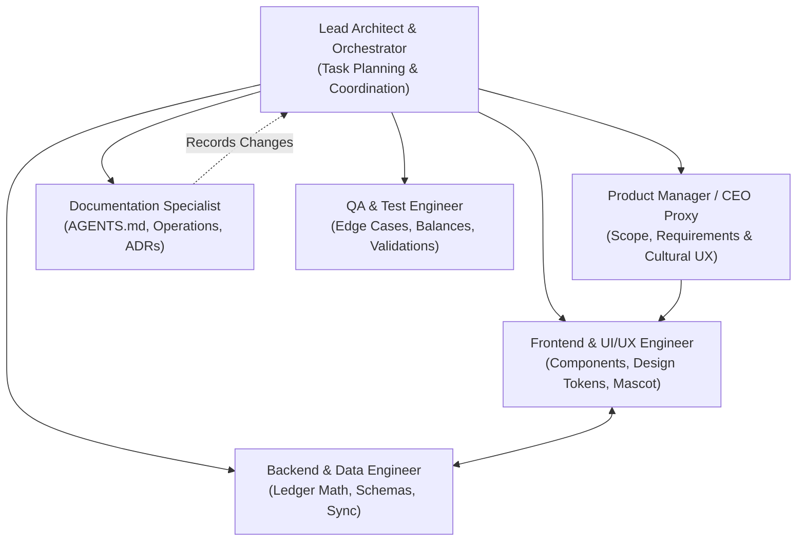

# AGENTS.md — Tabby Operating Manual & Project Source of Truth

> **Application:** Tabby  
> **Tagline:** *"Keep tabs. Settle up."*  
> **Target Audience:** Friends, roommates, barkadas, and social circles in the Philippines  
> **Core Currency:** Philippine Peso (`₱` / PHP — Centavo-accurate integer arithmetic)  
> **Repository:** [https://github.com/Zalweb/Tabby](https://github.com/Zalweb/Tabby)  
> **Branch:** `main`  
> **Documentation Model:** Single living document source of truth (`AGENTS.md`) per CEO directive.

---

## 1. Executive Summary & Philosophy

**Tabby** is a warm, socially frictionless personal and peer-to-peer financial tracking application built specifically for Filipino social spending habits. It eliminates the social anxiety, awkwardness ("hiya"), and friction surrounding shared expenses, dining out, borrowing ("utang"), and settling debts.

### Core Philosophy: *"Friendship First, Accounting Second"*
Traditional expense trackers feel cold, corporate, or confrontational. Tabby introduces a friendly cat mascot companion, empathetic Taglish/conversational English microcopy, and instant settlement shortcuts tailored for Philippine payment rails (GCash, Maya, Bank Transfer, and Cash).

---

## 2. CEO Directives & Conversation Tracker

### Core Product Directives
1. **Never Weaponize Debts:** The app must never sound like a debt collector, a bank, or a legal demand letter. No red warning banners for standard pending tabs.
2. **Defuse Awkwardness with Warmth:** Asking friends for money is socially uncomfortable in the Philippines ("nakakahiya maningil"). Tabby absorbs that social tension through cute, disarming mascot animations, lighthearted reminders, and clear settlement links.
3. **Speed is King:** Logging who paid for lunch must take under 5 seconds. If logging takes too long, users will fall back to disorganized Messenger group chats or forget entirely.
4. **Philippine-First Context:** The app is built from the ground up for the Philippine financial ecosystem (PHP `₱`, GCash, Maya, Cash, KKB dining habits).
5. **Consolidated Documentation (`AGENTS.md` Single Source of Truth):** Keep project documentation, operational protocols, branding tokens, ADRs, conversation tracking, and roadmap consolidated in `AGENTS.md`.

### CEO Conversation & Decisions Log

| Date | Stakeholder / Source | Directive / Decision | Rationale | Impacted Areas |
| :--- | :--- | :--- | :--- | :--- |
| **2026-09-13** | CEO / Product Lead | Adopt *"Keep tabs. Settle up."* as official tagline. | Simple, punchy, action-oriented, universally understood. | Branding, Splash screen, App Store metadata. |
| **2026-09-13** | CEO / Product Lead | Mascot must have turnaround views and explicit emotion states. | Humanizes transactions; visually signals zero-balance celebration ("Bayad na!"). | Mascot assets, UI empty states, animation hooks. |
| **2026-09-13** | CEO / Product Lead | Prioritize GCash & Maya as primary settlement references over credit cards. | GCash & Maya are the de facto P2P payment rails for Filipino peer groups. | Settlement flow, QR code viewer, receipt sharing. |
| **2026-09-13** | CEO / Product Lead | Enforce integer centavo calculations for all currency values. | Prevents IEEE-754 floating point rounding drift when splitting odd bills. | Ledger database, Calculation engine, API contracts. |
| **2026-09-13** | CEO / Product Lead | Consolidate documentation into `AGENTS.md` and remove secondary markdown files. | Keep agent and team context in a unified living document to streamline workflows. | `AGENTS.md`, `README.md`, repository structure. |

---

## 3. Agent Departmental Roles & Responsibilities

All AI agents and contributors operating within this repository act under distinct departmental roles to maintain separation of concerns, high technical velocity, and code quality.



### Role Matrix

| Department / Role | Primary Responsibilities | Deliverables & Scope |
| :--- | :--- | :--- |
| **Lead Architect / Orchestrator** | Task decomposition, technical direction, cross-agent workflows, code review. | Architecture roadmaps, PR reviews, workflow definitions. |
| **Product Manager / CEO Proxy** | Voice of CEO and user, cultural validation ("utang" etiquette), feature prioritization. | User stories, acceptance criteria, CEO directive alignment. |
| **Documentation Specialist** | Repository memory, technical guides, operating manuals, ADRs, changelog tracking. | `AGENTS.md`, `README.md`, API & architecture documentation. |
| **Frontend / UI/UX Engineer** | Component architecture, Tailwind styling, brand tokens, mascot animation states. | UI components, page layouts, interactive split calculator. |
| **Backend / Data Engineer** | Ledger data models, double-entry balance math, offline SQLite/Supabase synchronization. | Schema migrations, balance calculation engines, API endpoints. |
| **QA & Reliability Engineer** | Financial rounding test cases, zero-balance verification, cross-device testing. | Unit test suites, end-to-end user journey tests, balance audit scripts. |

---

## 4. Brand System, Design Tokens & Mascot Assets

All frontend implementations must strictly adhere to the established brand tokens and character specifications.

### Visual Assets
Canonical branding assets are located in [`assets/branding/`](assets/branding/):
- **Tabby App Icon & Logo:** [`assets/branding/tabby-icon.jpg`](assets/branding/tabby-icon.jpg)
- **Mascot Turnarounds & Emotion Sheet:** [`assets/branding/tabby-mascot-sheet.jpg`](assets/branding/tabby-mascot-sheet.jpg)

### Color Palette & Design Tokens

| Token Name | Hex Code | RGB | Role / Usage |
| :--- | :--- | :--- | :--- |
| **Charcoal Primary** | `#1F1F1F` | `rgb(31, 31, 31)` | Headers, primary buttons, high-contrast structural UI elements |
| **Accent Highlight** | `#FFB74D` | `rgb(255, 183, 77)` | Warm amber, mascot accents, CTA highlights, pending badges |
| **Background Light** | `#F8F8F8` | `rgb(248, 248, 248)` | App canvas background, light mode surface, clean spacing |
| **Secondary Muted** | `#9CA3AF` | `rgb(156, 163, 175)` | Subtitles, inactive tabs, dividers, timestamp captions |
| **Surface White** | `#FFFFFF` | `rgb(255, 255, 255)` | Card surfaces, bottom sheets, modal dialogs, input containers |
| **Settled / Success Green** | `#10B981` | `rgb(16, 185, 129)` | Fully settled tabs ("Bayad na"), positive balances |
| **Debt / Owed Red** | `#EF4444` | `rgb(239, 68, 68)` | Amounts owed, critical balance alerts |

### CSS Variables & Tailwind Tokens

```css
:root {
  --tabby-primary: #1F1F1F;
  --tabby-accent: #FFB74D;
  --tabby-bg-light: #F8F8F8;
  --tabby-secondary: #9CA3AF;
  --tabby-surface: #FFFFFF;
  --tabby-success: #10B981;
  --tabby-danger: #EF4444;
}
```

```javascript
// tailwind.config.js
module.exports = {
  theme: {
    extend: {
      colors: {
        tabby: {
          charcoal: '#1F1F1F',
          accent: '#FFB74D',
          light: '#F8F8F8',
          muted: '#9CA3AF',
          surface: '#FFFFFF',
          success: '#10B981',
          danger: '#EF4444',
        }
      }
    }
  }
}
```

### Mascot Character System & State Machine (FSM)
The Tabby cat mascot defuses the social tension surrounding money:
1. **`IDLE_NEUTRAL` (Neutral / Welcoming):** Default dashboard companion; greets the user based on net balance state.
2. **`CALCULATING` (Calculating / Logging):** Displayed during bill splitting, keypad input, and expense entry.
3. **`GENTLE_NUDGE` (Reminder State):** Soft, polite mascot illustration rendered on shareable reminder cards.
4. **`CELEBRATING` (Settled State):** Joyful mascot with confetti when a tab is settled ("Bayad na! All settled!").
5. **`SLEEPING` (Empty State):** Relaxed cat nap illustration when all active tabs are cleared (₱0.00 balance).

---

## 5. Filipino Cultural Lexicon & Microcopy Matrix

Peer financial interactions in the Philippines rely heavily on cultural nuances. AI agents and developers must strictly follow these definitions and phrasing standards:

### Cultural Lexicon & Etiquette

| Term / Concept | Cultural Meaning | Tabby Implementation | DO NOT Use |
| :--- | :--- | :--- | :--- |
| **Utang** | Debt or borrowed money. Carries social friction or shame if emphasized coldly. | Reframe as an open "Tab" or "Paki-settle". Keep it neutral and companionable. | "Delinquent debt", "Arrears", "Defaulter". |
| **Bayad na ako** | "I have already paid" / Confirmed settlement. | Tap-to-confirm settlement banner. Triggers celebratory mascot confetti. | "Payment cleared by creditor". |
| **KKB** | *Kanya-Kanyang Bayad* ("Each pays their own" / Go Dutch). | Dedicated 1-tap bill split mode dividing the total bill evenly or per-item with auto-tax/service charge distribution. | "Individual liability partition". |
| **Abono / Salo** | Covering someone's share upfront when they lack cash or change. | "Covered by [Name]" tag with quick 1-click repayment tab creation. | "Credit extension", "Underwriting". |
| **Libre** | A genuine treat/gift where repayment is explicitly NOT expected. | "Mark as Libre" toggle which removes the amount from net debt balances and files it under "Treats". | Treating it as a zero-interest loan. |
| **Maningil / Nudge** | Asking for payment. Typically creates social hesitation ("hiya"). | Friendly pre-composed shareable cards with cute mascot saying: *"Psst! Pasuyo nung tab natin for [Lunch] 🐾"* | Aggressive collection demands or countdown timers. |
| **Sukli** | Change from cash transactions. | Exact centavo split rounder (options to round up to nearest ₱5 or ₱10 for cash ease). | Ignoring cash divisibility. |

### Microcopy Comparison Matrix

| Context | ❌ Cold / Corporate (Avoid) | ✅ Tabby Way (Adopt) |
| :--- | :--- | :--- |
| **Dashboard Summary (Owed)** | "Total Debt Outstanding: ₱450.00" | "You're owed **₱450.00** across 2 friends" |
| **Dashboard Summary (Owing)** | "You are in debt: ₱250.00" | "You have **₱250.00** in active tabs to settle" |
| **Gentle Reminder Button** | "Send Collection Notice" | "Send Gentle Nudge 🐾" / "Pasuyo Reminder" |
| **Reminder Message (Shareable)**| "Notice: You owe [User] ₱250. Pay immediately." | "Hey! Here's our tab for milk tea (₱250). Settle up whenever you're ready! [Link] 🐱" |
| **Settlement Confirmation** | "Transaction completed. Balance zeroed." | "All settled up! Salamat! 🎉" |
| **Zero Debt State** | "No records found in database." | "All tabs cleared! Time for a cat nap. 😴" |
| **Equal Split Action** | "Execute Split by N" | "Split Equally (KKB)" |

### Currency Formatting Rules
- Always prefix Philippine currency with `₱` (U+20B1) followed by a non-breaking space or standard spacing.
- Always display 2 decimal places for financial totals (e.g., `₱1,250.00`).
- Use comma thousands separators: `₱12,500.50`.

---

## 6. Architecture Decision Records (ADRs)

### ADR-001: Integer Centavo Precision for Currency Math
- **Status:** Accepted (2026-09-13)
- **Decision:** All monetary values in databases, internal calculations, APIs, and state management stores MUST be represented as **integer centavos** (`1 PHP = 100 centavos`).
- **Rationale:** Standard IEEE-754 floating-point arithmetic causes rounding drift when splitting odd bills across multiple people. Integer centavos guarantee deterministic, zero-drift balance calculations.

### ADR-002: Local-First Offline Storage with Background Cloud Sync
- **Status:** Accepted (2026-09-13)
- **Decision:** Every tab entry, settlement mark, and contact creation is written synchronously to local persistent storage (SQLite / IndexedDB) before network requests. Background workers sync to remote cloud storage (Supabase / Postgres).
- **Rationale:** Users frequently split tabs in basement food courts, crowded restaurants, and spots with spotty cellular coverage in the Philippines.

### ADR-003: Emotion-Driven Financial UI with Mascot State Machine
- **Status:** Accepted (2026-09-13)
- **Decision:** Implement a deterministic Finite State Machine (FSM) for the mascot character (`IDLE_NEUTRAL`, `CALCULATING`, `GENTLE_NUDGE`, `CELEBRATING`, `SLEEPING`).
- **Rationale:** Visual mascot reactions disarm social anxiety and transform financial record-keeping into a warm experience.

### ADR-004: Non-Custodial Settlement Model with GCash/Maya Intent References
- **Status:** Accepted (2026-09-13)
- **Decision:** Tabby acts strictly as an **accounting ledger and social coordination tool**, NOT a custodial wallet. Payments are facilitated via deep-links, QR codes, and attached transaction reference numbers.
- **Rationale:** Avoids Bangko Sentral ng Pilipinas (BSP) money service business licensing hurdles while supporting the dominant local payment methods directly.

### ADR-005: Consolidated Living Documentation Model
- **Status:** Accepted (2026-09-13)
- **Decision:** Consolidate agent operating rules, design tokens, ADRs, cultural guidelines, conversation history, and roadmap into `AGENTS.md` as the single source of truth.
- **Rationale:** Per CEO directive, eliminates multi-file synchronization overhead and ensures immediate full-context ingestion for all agents and contributors.

---

## 7. Operational Protocols & Rules of Engagement

1. **Strict Context Preservation:**
   - Always inspect `AGENTS.md` before proposing UX, copy, or architectural changes.
   - Update `AGENTS.md` directly when new decisions or roadmap items are agreed upon.
2. **Single Source of Truth for Ledger Math:**
   - Financial balances must never use floating-point math. Use integer centavos (`₱100.50` = `10050 centavos`).
3. **Cultural Tone & Microcopy Guardrails:**
   - Never use aggressive collection language ("Delinquent", "Overdue debt", "Penalty").
   - Prefer gentle, culturally attuned phrasing ("Gentle nudge", "Paki-settle", "Bayad na ako", "KKB").
4. **Git Discipline & Conventional Commits:**
   - Default branch: `main`.
   - Commit formatting: `feat:`, `fix:`, `docs:`, `style:`, `refactor:`, `test:`, `chore:`.
   - Always verify a clean working tree (`git status`) after changes.

---

## 8. Planned Feature Roadmap

### Phase 1: MVP Core (1-on-1 Tabs & Settlements)
- [ ] **Quick Tab Entry:** Add an expense in under 5 seconds (Amount, Who paid, Who owes, Description).
- [ ] **1:1 Balance Tracker:** Clear running balance between two users (*"You owe Karl ₱250"* / *"Karl owes you ₱150"* -> Net: *"You owe Karl ₱100"*).
- [ ] **Payment Settlement ("Bayad Na!"):** Mark tab settled with payment method tagged (GCash, Maya, Cash).
- [ ] **Mascot Mood Integration:** Happy mascot on settlement; sleeping cat on zero balance.

### Phase 2: Group Tabs & Smart Split
- [ ] **Group Expenses (Barkada Trips, Dinners, Bills):** Multi-person bill splitting.
- [ ] **Split Modes:** Equal split, itemized split, and percentage/exact amounts.
- [ ] **KKB Mode (Kanya-Kanyang Bayad):** Quick tax + service charge distributor.
- [ ] **Gentle Reminder Links:** Shareable SMS/Messenger card with friendly mascot nudge graphic.

### Phase 3: Local-First Architecture & Cloud Sync
- [ ] **Offline-First Persistence:** SQLite / IndexedDB for instantaneous local access without internet.
- [ ] **Cloud Backup & Peer Sync:** Supabase / Postgres integration for multi-device sync and real-time tab updates.
- [ ] **Export & Audit:** Export tab history as CSV or shareable receipt snapshot.

### Phase 4: Financial Quality of Life & Polish
- [ ] **GCash / Maya Deep-link & QR Generator:** Display settlement QR codes directly inside the app.
- [ ] **Spending Analytics:** Monthly breakdowns of personal vs. shared expenditures.
- [ ] **Custom Mascot Costumes & Mood Packs:** Themed seasonal cat expressions.

---

## 9. Project Changelog & Version History

This project adheres to [Semantic Versioning](https://semver.org/spec/v2.0.0.html) and [Keep a Changelog](https://keepachangelog.com/en/1.1.0/).

### [Unreleased]
- MVP Core 1-on-1 tab entry and balance calculation engine.
- Philippine Peso (`₱`) centavo-accurate transaction state machine.
- Interactive bill split calculator with service charge and tax distribution (KKB mode).
- GCash and Maya settlement reference generation.
- Interactive mascot reaction states based on tab status.

### [0.1.0] - 2026-09-13
- Consolidated complete project documentation, CEO conversation logs, cultural guidelines, brand tokens, and ADRs into `AGENTS.md`.
- Added visual branding assets:
  - App Icon & Logo: [`assets/branding/tabby-icon.jpg`](assets/branding/tabby-icon.jpg)
  - Mascot Turnaround & Mood Sheet: [`assets/branding/tabby-mascot-sheet.jpg`](assets/branding/tabby-mascot-sheet.jpg)
- Initial repository setup and branch baseline (`main`).
